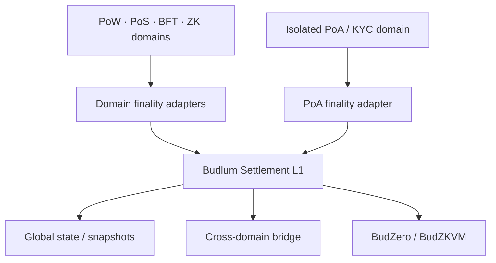

# Budlum Core

**Universal Settlement Layer** for a post-quantum, multi-consensus world.

Budlum is a research-grade Layer-1 that does **not** replace other chains. It **settles** them: each domain keeps its own consensus (PoW, PoS, PoA, BFT, ZK, or custom); Budlum verifies finality proofs and records cross-domain value transfer as cryptographic fact.

[](https://github.com/budlum-xyz/budlum/actions)
[](https://github.com/budlum-xyz/budlum)
[](https://www.rust-lang.org/)
[](LICENSE)

---

> **Controlled public-devnet candidate (v0.3-dev)**  
> Suitable for research and controlled experiments with explicit risk disclosure.  
> **Not** audited mainnet software. **Do not** use for real-value production traffic.

---

## Module dashboard (Phase 10 §4)

Kural: **toplam satırı hiçbir modül uyarı satırının yerini almaz.** "Kaç test var"
sorusuna toplam cevap verir; "hangisine güvenilir" sorusunun cevabı her zaman
modül satırında (ve modül README'sinde) kalır.

| Modül | Test | Kapı (isim-kilitli) | Durum |
| --- | --- | --- | --- |
| Budlum Core | **755 lib** (`cargo test --lib`, CI-kanıtlı) | `Budlum Core` job (fmt + clippy + test) | v0.3-dev devnet candidate |
| BudZero (BudZKVM) | **124** (`cargo test --workspace`, CI-kanıtlı) | `BudZero / BudZKVM` job | Z-B 64-derinlik Production-gated — ayrıntı: `budzero/README.md` |
| B.U.D. | **12 zorunlu** (9 invariant + 3 e2e) | `B.U.D. E2E Invariants` job + `scripts/check-bud-e2e.sh` | devnet-only; sahte-yeşil riski işaretli — `src/storage/README.md` |
| BNS (`.bud`) | **8 test** (`test_bns_*`) | `BNS Name Registry` job + `scripts/check-bns-gate.sh` | iskelet mevcut; genişletme ayrı talimat — `src/bns/README.md` |
| EVM ChainAdapter | **58 test** (RLP+MPT+receipt+header+verify) | `Budlum Core` job (F10.1+F10.2 ship edildi) | H4 kapanması (kriptografik receipt verify); sync-committee opsiyonel — `src/cross_domain/evm/README.md` |
| AI Inference | **76 test** (P0+P5 ship) | `Budlum Core` job | attestation model (zkML DEĞİL); F06 largely closed — `src/ai/README.md` |
| Pollen (B.U.D. Marketplace) | **8 test** (P0 tipler) | `Budlum Core` job (P1+ sonrası gate adayı) | iskelet (P0); Faz-1 soft-enforcement — `src/pollen/README.md` |
| Hub Registry | iskelet (parent suite) | — | mainnet v1 kapsam dışı (M10) — `src/hub/README.md` |
| SocialFi/NFT | parent suite | — | mainnet v1 kapsam dışı (M10) — `src/socialfi/README.md` |

Not: Core'un 755 sayısı B.U.D. ve BNS testlerini de içerir (paylaşılan lib suite);
modül satırları kendi isim-kilitli kapılarını ayrıca raporlar.

---

## Why Budlum

| Problem today | Budlum shift |
| --- | --- |
| Quantum break of ECDSA/Ed25519 (~2030–35) | **BLS + Dilithium5 hybrid finality** in the core path |
| 20k+ isolated chains | **Universal Settlement Layer** — verify any domain’s finality |
| CBDC / sovereign silos | Domains + trust-minimized bridge lifecycle |
| TradFi (PoA) vs DeFi (PoS) wall | Same `GlobalBlockHeader` settlement record |
| Bridge hacks ($2.5B+) | Lock → mint → burn → unlock with proof gates |
| AI agents without settlement | In-tree BudZKVM STARK execution |

Strategic analysis: [`docs/03_paradigma_analizi.md`](docs/03_paradigma_analizi.md).

---

## Architecture



See the [Architecture Atlas](docs/ARCHITECTURE.md) for detailed system,
trust-boundary, transaction signing, bridge, EVM verification, snapshot,
durability, AI, B.U.D., CI and mainnet-launch diagrams.

**Crates / layout**

| Path | Role |
| --- | --- |
| `src/consensus/` | PoW · PoS · PoA engines |
| `src/domain/` | Domain registry, finality adapters |
| `src/cross_domain/` | Bridge, messages, replay protection |
| `src/chain/` | Blockchain, finality (BLS/QC), snapshots |
| `src/execution/` | Tx executor + BudZKVM host |
| `src/core/governance.rs` | Validator-only governance: stake-weighted proposals (fee/reward/param/slash), quorum finalize |
| `src/rpc/` | JSON-RPC (auth, IP, CORS, rate limits) |
| `src/crypto/` | Ed25519, BLS, Dilithium, PKCS#11 |
| `budzero/` | BudZKVM ISA, VM, compiler, state and STARK prover workspace |

Since Phase 0.37, **BudZero is integrated into this repository**. The former
`lubosruler/BudZero` repository (historical) is not a build-time dependency.
The canonical repository is `budlum-xyz/budlum`.

---

## Quick start

```bash
# Requires Rust 1.94+, protoc
git clone https://github.com/budlum-xyz/budlum.git
cd budlum

# L1 (uses the in-tree budzero crates)
cargo build --release
cargo test --lib

# Full BudZero/BudZKVM workspace
cargo test --manifest-path budzero/Cargo.toml --workspace

cargo run -- --network devnet
```

**Mainnet validators:** PKCS#11 is required for consensus signing. Disk-backed `ValidatorKeys` (BLS + PQ material) are **rejected on mainnet** until HSM paths exist for those secrets (Phase 0.35).

---

## Security posture (selected)

Hardening is iterative (Phase 0.16–12.5). Highlights:

- Cheap tx checks before signature verify (DoS)
- Governance: validator-only proposals, fee/reward bounds, registry param validation
- Bridge mint requires `expected_block_hash`; PoW mint requires a bounded, recomputed `pow-header-chain-v1` proof (legacy declared-depth proofs stay mint-gated)
- PoA leader selection uses hash-mix (not pure round-robin)
- BLS keypair load validates G2 encoding and `pk = g·sk`
- RPC: public auth fail-closed; operator methods are mode-gated/localhost-only; **X-Real-IP only if `trusted_proxies` set**; constant-time API key compare
- BudZKVM `VerifyMerkle` gated off in Production ISA until Z-B Commit 3.5
- BudZero event-digest AIR/public-input alignment retained and its crates moved in-tree (Phase 0.37)

This is **not** a substitute for a professional external audit.

---

## Development

```bash
cargo fmt --all -- --check
cargo clippy --lib --tests -- -D warnings
cargo test --lib          # 563 unit/integration tests (lib)
```

CI (GitHub Actions): separate fmt → clippy `-D warnings` → test gates for the L1 and the in-tree BudZero workspace.

> Test sayısı Phase 8.4 (Dalga 7b) itibarıyla CI rozet-botuyla **otomatik** tazelenir (loop-guard'lı self-commit; kullanıcı Q5 kararı — yalnız sayı değişiminde, yalnız main push'unda). Son manuel kanıt notu: `cargo test --lib` → 563 passed / (Phase 9+ badge-bot).

---

## Status & roadmap

Aligned with [budlum-xyz/Budlum](https://github.com/budlum-xyz/Budlum) Research Roadmap + ch12 mainnet blockers. Full matrix: `PHASE0.36_ORG_ROADMAP_AUDIT.md` (working notes) and below.

| Area | State | Org roadmap |
| --- | --- | --- |
| Multi-consensus domains | Implemented | ✓ |
| BLS + Dilithium QC finality | Implemented | ✓ |
| Bridge lifecycle | Implemented + forgery gates; PoW mint only after applied header-chain finality | ✓ Phase 0.37 |
| BudZKVM host | In-tree `budzero/` workspace; one-commit compatibility boundary | ✓ Phase 0.37 |
| Full Z-B Merkle soundness | Partial fixes Phase 0.36; **Production-gated** until positive 64-depth green | BudZero Phase 5 claim vs reality |
| PoW light-client finality | Bounded contiguous headers; recomputed hash/link/root/difficulty/work; legacy proof mint-gated | ✓ Tur **13.5** |
| BLS/PQ HSM (beyond Ed25519 PKCS#11) | Disk keys banned; PKCS#11 Ed25519 + dev/test BLS/PQ mock backend present; vendor-native BLS/PQ HSM remains audit item | PHASE **2.1** |
| Personas (user / developer / enterprise PoA) | `config/personas/*` + [docs/PERSONAS.md](docs/PERSONAS.md) | Tur **13** |
| Archive/backup/runbooks | Archive fail-closed policy, atomic verified backup + restore drill, PoA/RPC/HSM runbook | ✓ Tur **13.5** |
| BudZero performance | Reproducible proof time/size baseline harness | ✓ baseline Tur **13.5** |
| B.U.D. storage network | Implemented (Faz 1-2 + Faz 5 iskeleti); Faz 3 pending Z-B gate | **Phase 0.38** |
| External audit / TLA+ / Privacy / AI | External audit checklist ready; TLA+/Privacy/AI remain research — not claimed audited | PHASE **2.5** |

## Mainnet v1 Kapsamı

Bu bölüm, mainnet v1 lansmanında **ne var** ve **ne yok** olduğunu netleştirir.

### Mainnet v1'de VAR

- Multi-consensus L1 (PoW / PoS / BFT / PoA)
- BLS + Dilithium finality
- Bridge lifecycle (lock/mint/burn/unlock)
- BudZKVM host (in-tree)
- B.U.D. storage (Faz 1-2 + Faz 5 iskeleti; Faz 3 VerifyMerkle gate sonrası)
- BNS (.bud name service)
- SocialFi NFT sistemi
- AI Inference layer (model kayıt, attestation, soft incentive)
- Universal Relayer (permissionless)
- $BUD tokenomics (100M sabit arz, vesting, yakım)
- Governance (parametre değişikliği, kanıtlı slashing)
- EVM ChainAdapter (F10 RLP + MPT + receipt verify)

### Mainnet v1'de YOK (v2 planı)

| Özellik | Durum | Neden v1'de yok |
|---------|-------|-----------------|
| Formal verification (TLA+ / Coq) | Araştırma aşamasında | Kapsamlı formal modelleme zaman gerektirir |
| Privacy layer (ZK-based) | Araştırma aşamasında | VerifyMerkle 64-depth production gate sonrası |
| AI execution layer | Araştırma aşamasında | Zincir-üzeri AI çalıştırma henüz tasarlanmadı |
| Full Z-B Merkle soundness | Production-gated | 64-depth pozitif/negatif test seti bekleniyor |
| Vendor-native BLS/PQ HSM | Mock backend mevcut | Gerçek donanım entegrasyonu operasyonel |

### Mainnet v1 Kapsam Dışı

- Launchpad / presale mekanizmaları
- $LUM token (ayrı proje)
- DeEd (Decentralized Education) — ayrı repo
- Budlum Go (supply chain) — ayrı repo

## Research Roadmap Status (Budlum + BudZero — B.U.D. Hariç)

**Son güncelleme:** 2026-07-15 (Phase 2 §1.3-§1.7 kapanış paketi).

Bu tablo `budlum-xyz/Budlum` Research Roadmap + ch12 mainnet blockers
maddelerinin durumunu gösterir. B.U.D. (Broad Universal Database) **bu
tablodan bilinçli olarak hariç tutulmuştur** — ayrı turlarda
(Phase 0.38/0.40/0.42+) takip edilir.

| Madde (org) | Durum (budlum-xyz, 2026-07-19) | Adım |
|-------------|--------------------------------------|-----|
| Devnet economic hardening | ✅ Closed (erken turlar + tokenomics) | — |
| Settlement atomicity | ✅ Closed | — |
| Verified settlement hardening | ✅ Closed (finality adapters, parent links) | — |
| Verified bridge return path | ✅ Closed + Phase 0.34 PoW mint ban | 12.5 |
| Sync hardening | ✅ Closed | — |
| PKCS#11 HSM signer (Ed25519) | ✅ Closed (PoS/PoA blok üretimine bağlı) | 12.5 |
| **BLS/PQ HSM (beyond Ed25519)** | ✅ **Policy/tooling ready** — disk keys yasak; BLS/PQ mock backend dev/test için var; vendor-native mechanism audit item | **Phase 2.1** |
| BLS finality protocol | ✅ Closed (prevote/precommit + testler) | 13 |
| **Finality live-path live scan** | ✅ **Closed** — `src/tests/finality_live_path.rs` + `docs/operations/FINALITY_LIVE_PATH.md` | **Phase 2.3** |
| RPC dual listener | ✅ Closed + Phase 0.35 B2/B3 | 12.5 |
| P2P hardening | ✅ Closed | 12.5 |
| Snapshot V2 | ✅ Closed (archive policy `config/archive.toml`) | 13.5 |
| Observability Prometheus | ✅ Closed (latency histogram wiring) | 13.5 |
| Deployment docker/systemd | ✅ Closed (runbook) | 13.5 |
| **ConsensusStateV2 migration** | ✅ **Closed / skeleton** — fail-closed `from_bytes()` schema window + offline `--migrate-v2` backup gate | **Phase 2.4** |
| **External audit** | ✅ **Checklist ready** — `docs/AUDIT_CHECKLIST.md`; harici audit yapılmadı/audited iddiası yok | **Phase 2.5** + launch öncesi |
| **Fuzzing + dependency audit + SBOM** | ✅ **Tooling ready** — `fuzz/`, `scripts/audit-deps.sh`, `scripts/generate-sbom.sh`, `docs/operations/*` | **Phase 2.7** |
| ZKVM optimizations | ⏳ Baseline complete (proof time/size harness) | 13.5 |
| Formal verification (TLA+) | ❌ Süreç — checklist | 13.9 |
| Privacy layer | ❌ Araştırma | 13 serisi dışı |
| AI execution layer | ❌ Araştırma | 13 serisi dışı |
| BudZero (BudZKVM) workspace | ✅ Closed (in-tree `budzero/`) | 13.5 |
| Z-B valid 64-depth | ⏳ Partial (Production-gated) | BudZero |
| Personas (user/dev/PoA) | ✅ Closed (`config/personas/*` + `docs/PERSONAS.md`) | 13 |

**Toplam:** Phase 2 §1.1 ve §1.3-§1.7 paketleri sonrası BLS/PQ HSM policy/tooling,
finality live-path, migration skeleton, audit checklist ve fuzz/dependency/SBOM
tooling kapatıldı. Açık ana mainnet engelleri artık bağımsız harici audit,
vendor-native BLS/PQ HSM mekanizma doğrulaması ve araştırma satırlarıdır
(Privacy/AI/TLA+ tam formal çalışma). Harici audit checklist hazırdır ama
bağımsız audit yapılmadığı için “audited” iddiası yoktur.

**B.U.D. Faz 1-2 + Faz 5 iskeleti** Phase 1 kapsamında kod tabanındadır.
Phase 2 devamında B.U.D. Faz 5 için ChainActor storage commands, otomatik
B.U.D. storage maintenance (challenge issuance + missed-challenge finalization)
ve storage economics accounting (operator reward accrual + slashed-bond ledger +
event report) yolu eklenmiştir. Faz 3+ gerçek Proof-of-Storage ise BudZKVM `VerifyMerkle`
64-depth production gate’ine bağlı olarak sonraki adımlarda takip edilir.

### Personas (same binary)

Operational guides: [production / enterprise PoA](docs/operations/PRODUCTION_RUNBOOK.md)
and [archive backup/restore](docs/operations/ARCHIVE_AND_BACKUP.md).

```bash
cargo run -- --config config/personas/user-devnet.toml
cargo run -- --config config/personas/developer.toml
# enterprise-poa.toml requires PKCS#11 + env secrets; no disk ValidatorKeys
```

---

## B.U.D. (Broad Universal Database) — Phase 0.38

**Phase 0.38 Faz 1-2 + Faz 5** iskeleti eklendi. `ConsensusKind::StorageAttestation`
yeni enum varyantı + `STORAGE_OPERATOR = RoleId(5)` (permissionless) +
`ContentId` / `ContentManifest` / `StorageRegistry` (deal + challenge
ekonomisi) + 7 yeni JSON-RPC uç noktası. 3-aktör E2E testi + 9
ekip-bağımsızlık invariantı (`src/tests/bud_e2e.rs`).

**ÖNEMLİ — interim retrieval sınırlama:** `RetrievalChallenge` gerçek
**Proof-of-Storage DEĞİLDİR** (Phase 0.39 plan §2.5). Operatör sadece
istenen byte-range'i saklayarak testi geçebilir. Tam kanıt (Faz 3,
vision §8.3) BudZKVM `VerifyMerkle` + 64-depth SMT production gate'ine
bağlıdır; o Z-B gate kapanana kadar "proof-of-storage" iddiası YAPILMAZ
(sahte-yeşil yol riski, vision §9.1).

**Veri egemenliği kuralı (Phase 0.39 plan §0.5):** B.U.D.'un hiçbir
kritik fonksiyonu (deal açma, ücret ödeme, operatör keşfi, erişilebilirlik
denetimi, slashing) "Budlum ekibinin çalıştırdığı bir servise"
bağımlı değildir. Whitelist / admin / pause / freeze hook'u YOK.
Tüm 7 storage RPC herhangi bir node tarafından sunulur.

B.U.D. storage RPC'leri (`src/rpc/api.rs`):

| RPC | Yön | Amaç |
|-----|-----|------|
| `bud_storageRegisterManifest` | write | `ContentManifest` kaydı, `manifest_id` döner |
| `bud_storageGetManifest` | read | `manifest_id` → manifest bilgisi |
| `bud_storageGetDealsByManifest` | read | Tüm deal'lar (replica dahil) |
| `bud_storageGetDealsByShard` | read | `(manifest_id, shard_id)` → deal'lar |
| `bud_storageOpenChallenge` | write | Herkes; opener_bond > 0 anti-spam |
| `bud_storageAnswerChallenge` | write | Sadece deal.operator; on-chain hash-only dogrulama |
| `bud_storageGetOutcome` | read | `challenge_id` → `ChallengeResult` |

**B.U.D. mainnet launch'a dahil mi:** Phase 0.40 §1.2 bittikten sonra
değerlendirilecek. Şu an devnet-only.

## License

MIT — see [LICENSE](LICENSE).

## Contributing

See [CONTRIBUTING.md](CONTRIBUTING.md) and [SECURITY.md](SECURITY.md). Prefer small, tested PRs that keep CI green.
