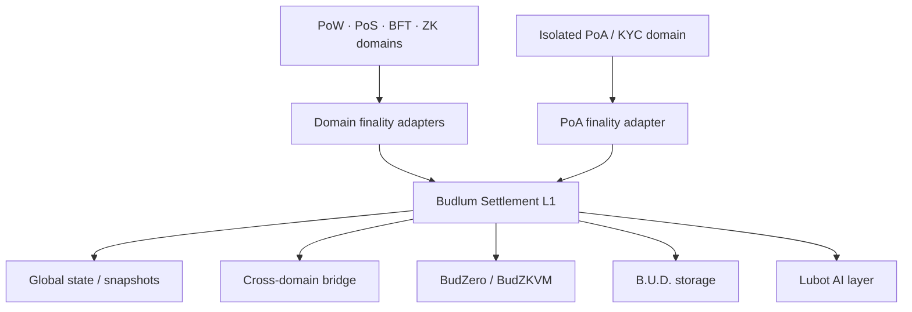

# Budlum

> **Budlum** is the **Universal Settlement Layer** — the next layer of the internet —
> focused on **data sovereignty** and **social flourishing**.

> Budlum does not replace other chains — it **settles** them. PoW, PoS, PoA, BFT, ZK
> and custom domains each run their own consensus; Budlum verifies their finality
> proofs and records cross-domain value transfer as a cryptographic fact on a single
> `GlobalBlockHeader` settlement record. Sovereignty over data, keys and computation
> stays with the participants — never with a central operator.

[](https://github.com/budlum-xyz/budlum/actions)
[](https://github.com/budlum-xyz/budlum)
[](https://www.rust-lang.org/)
[](LICENSE)
[](SECURITY.md)
[](https://github.com/budlum-xyz/budlum/actions)

---

## Why Budlum

| Problem today | Budlum's answer |
| --- | --- |
| Quantum break of ECDSA / Ed25519 (~2030–35) | **BLS + Dilithium hybrid finality** in the core path |
| 20,000+ isolated chains | **Universal Settlement Layer** — verify any domain's finality |
| Bridge hacks ($2.5B+ lost) | Lock → mint → burn → unlock with cryptographic proof gates |
| CBDC / sovereign data silos | Domains + trust-minimized bridge lifecycle |
| Data held by central operators | **Data sovereignty** — no whitelist, no admin, no pause/freeze hooks |
| AI agents without verifiable settlement | In-tree zkVM (BudZero) STARK execution |

---

## The Budlum ecosystem

Budlum is a family of composable components. Each lives in its own repository and
can evolve independently; together they form a data-sovereign settlement network.
This repository (`budlum`) is the umbrella — the L1 settlement core plus in-tree
integrations of the layers below, so the whole stack builds and tests as one.

| Component | Repository | In this repo | Role |
| --- | --- | --- | --- |
| **budlum-core** | [budlum-xyz/budlum-core](https://github.com/budlum-xyz/budlum-core) | `src/` (root crate) | The blockchain network: multi-consensus engines (PoW/PoS/BFT/PoA), execution, chain, permissionless validator/relayer registry with stake + slashing |
| **BudZero** | [budlum-xyz/BudZero](https://github.com/budlum-xyz/BudZero) | `budzero/` | ZK-native virtual machine (zkVM) + STARK prover — verifiable execution for AI inference and private computation |
| **B.U.D.** | [budlum-xyz/B.U.D.](https://github.com/budlum-xyz/B.U.D.) | `src/storage/` | Broad Universal Database — decentralized, data-sovereign storage (content addressing, deals, challenges) |
| **Lubot** | [budlum-xyz/Lubot](https://github.com/budlum-xyz/Lubot) | `src/lubot/` | Data-sovereign, closed-circuit, fully-decentralized AI (training + inference verifiable on-chain) |
| **budlum.com** | [budlum-xyz/budlum.com](https://github.com/budlum-xyz/budlum.com) | — | Project website |

> **Data-sovereignty invariant:** no critical function in the network depends on a
> service operated by "the Budlum team." Participation is permissionless (stake to
> join), storage/RPC/AI endpoints run on any node, and there are no admin / pause /
> freeze hooks. Sovereignty over data and keys remains with the participants.

---

## Architecture



Detailed system, trust-boundary, bridge, EVM verification, snapshot and AI diagrams:
[`docs/ARCHITECTURE.md`](docs/ARCHITECTURE.md).

**Core layout**

| Path | Role |
| --- | --- |
| `src/consensus/` | PoW · PoS · PoA · BFT engines |
| `src/domain/` | Domain registry + finality adapters |
| `src/cross_domain/` | Bridge, cross-domain messages, replay protection |
| `src/chain/` | Blockchain, BLS/QC finality, snapshots |
| `src/execution/` | Transaction executor + BudZKVM host |
| `src/registry/` | Permissionless stake-based registry (validator/verifier/relayer/storage) + slashing |
| `src/rpc/` | JSON-RPC (auth, per-IP quota, CORS, rate limits) |
| `src/crypto/` | Ed25519, BLS, Dilithium, PKCS#11 |
| `budzero/` | BudZKVM: ISA, VM, compiler, state, STARK prover |
| `src/storage/` | B.U.D. storage layer |
| `src/lubot/` | Lubot AI layer |

---

## Status

Budlum is **research-grade, controlled-devnet software** — suitable for research and
controlled experiments with explicit risk disclosure. It is **not** audited mainnet
software; do **not** use it for real-value production traffic.

**Implemented:** multi-consensus L1, BLS + Dilithium finality, bridge lifecycle
(lock/mint/burn/unlock) with forgery gates, permissionless registry + slashing,
in-tree BudZKVM, B.U.D. storage (content addressing + deal/challenge economy),
BNS (`.bud` names), SocialFi NFTs, Lubot AI inference layer, EVM chain adapter
(RLP + MPT + receipt verification), `$BUD` tokenomics, validator governance.

**Research / not yet claimed:** formal verification (TLA+), ZK privacy layer,
full on-chain AI execution, vendor-native BLS/PQ HSM beyond Ed25519 PKCS#11.
An external audit has **not** been performed — no "audited" claim is made.

Current status and live coordination: [`docs/STATUS.md`](docs/STATUS.md) and
[`docs/STATUS_ONLINE.md`](docs/STATUS_ONLINE.md).

---

## Quick start

```bash
# Requires Rust 1.94+ and protoc
git clone https://github.com/budlum-xyz/budlum.git
cd budlum

# Build the L1 (uses the in-tree budzero crates)
cargo build --release

# Run the L1 tests
cargo test --lib

# Full BudZero/BudZKVM workspace
cargo test --manifest-path budzero/Cargo.toml --workspace

# Run a devnet node
cargo run -- --network devnet
```

**Mainnet validators** must sign via PKCS#11; disk-backed `ValidatorKeys`
(BLS + post-quantum material) are rejected on mainnet until HSM paths exist.
Operational guides: [production / enterprise PoA runbook](docs/operations/PRODUCTION_RUNBOOK.md)
and [archive backup/restore](docs/operations/ARCHIVE_AND_BACKUP.md).

---

## Security

Hardening is iterative. Highlights: cheap pre-signature tx checks (DoS),
governance bounds (validator-only proposals, fee/reward limits), bridge mint
requires a bounded recomputed `pow-header-chain-v1` proof, BLS keypair load
validates G2 encoding and `pk = g·sk`, RPC public auth fail-closed with
constant-time API-key compare, BudZKVM `VerifyMerkle` gated off in production
until 64-depth soundness is proven. This is **not** a substitute for a
professional external audit. Report vulnerabilities privately via
[SECURITY.md](SECURITY.md).

---

## License

MIT — see [LICENSE](LICENSE). Contributing: [CONTRIBUTING.md](CONTRIBUTING.md).
