# Budlum Mimari Atlası

> **Durum:** Kod haritası ve hedef mimariyi birlikte gösterir. Diyagramlardaki
> `feature-gated`, `planlı` ve `mainnet blocker` etiketleri tamamlanmış üretim
> özelliği iddiası değildir.

## 1. Genel sistem mimarisi

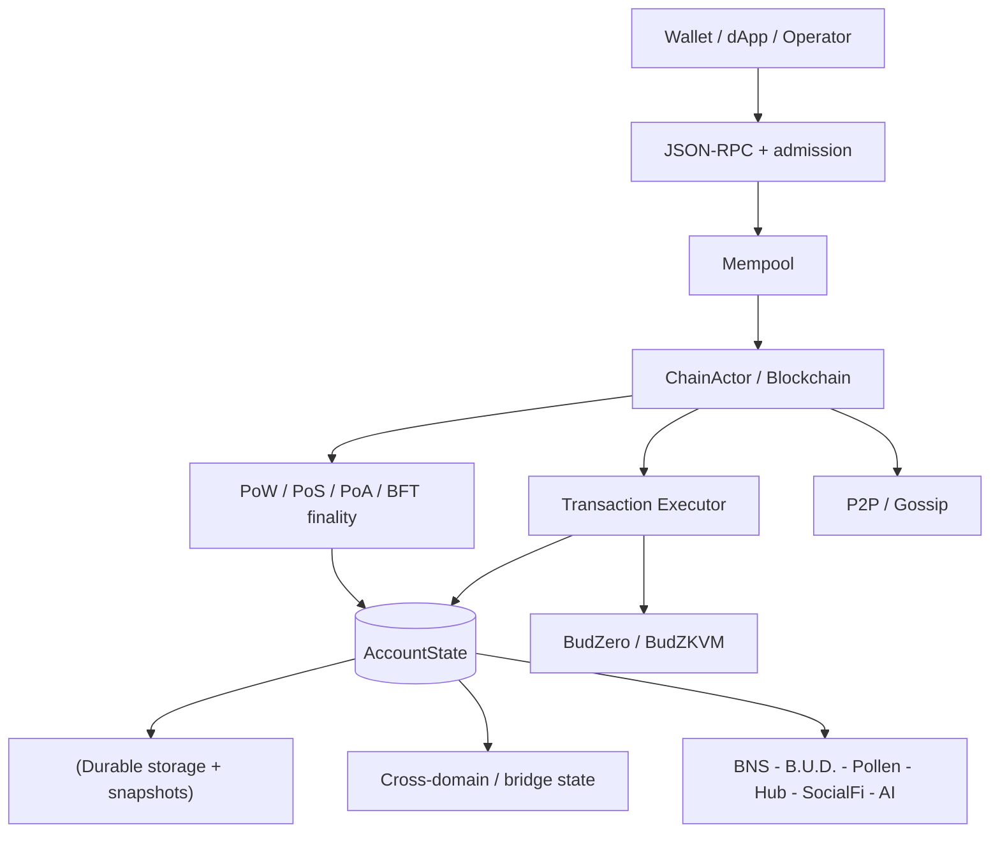

## 2. Consensus-domain izolasyonu

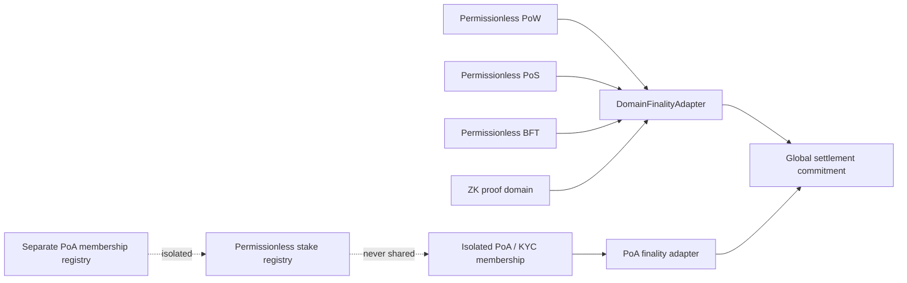

## 3. Transaction admission and V4 signing

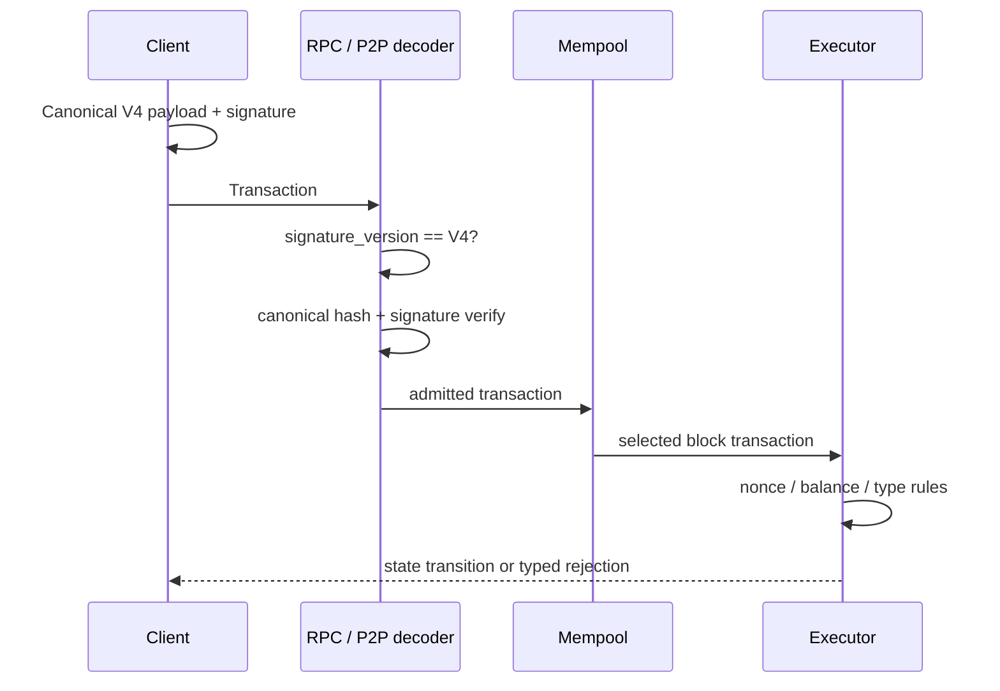

## 4. Cross-domain bridge lifecycle

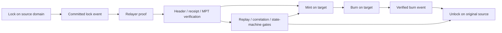

## 5. EVM receipt verification path

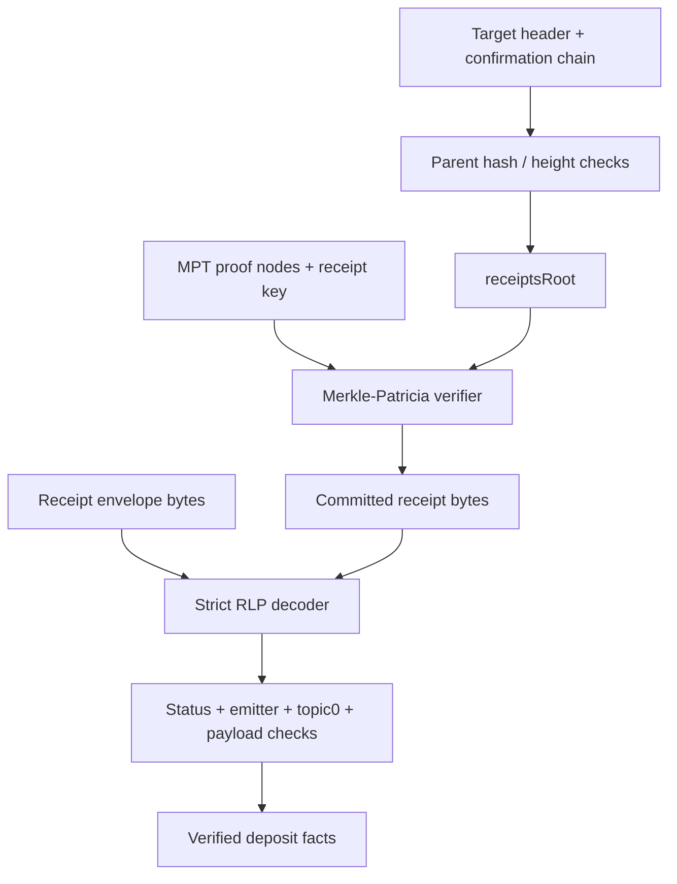

## 6. Snapshot trust and schema migration

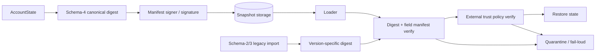

## 7. Critical durability boundary

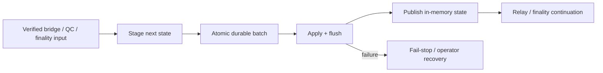

## 8. BudZero execution and proof boundary

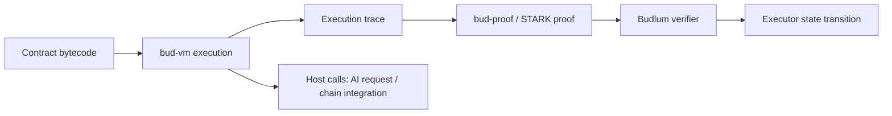

## 9. AI inference lifecycle

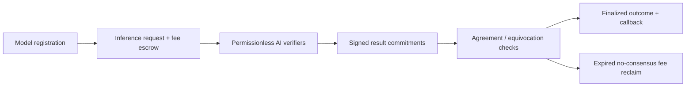

## 10. B.U.D. storage lifecycle

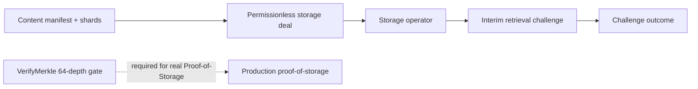

## 11. Mainnet launch gates

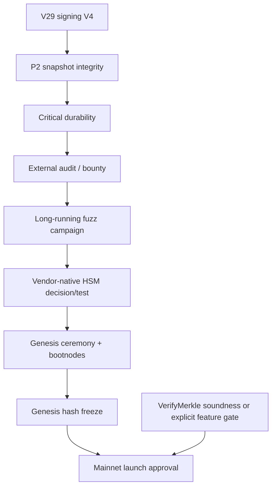

## 12. CI and security gates

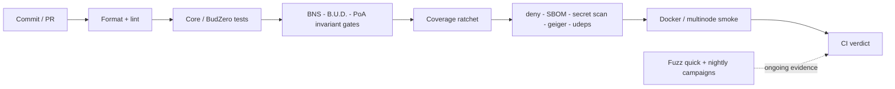


---

# Kapsamlı Sistem Diyagramları (Detaylı Veri Akışı)

## 13. Executor — tam state transition pipeline

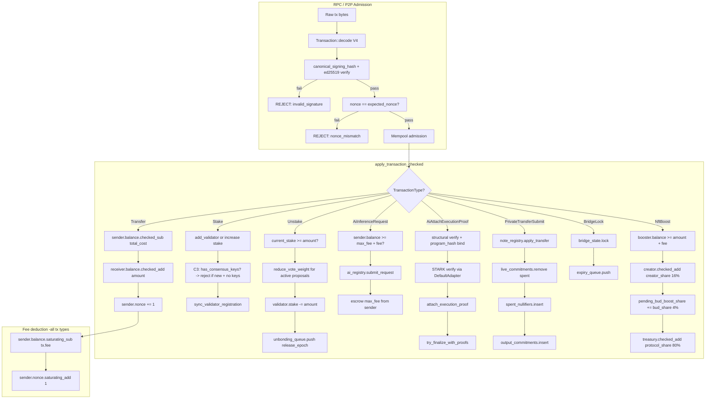

## 14. Privacy layer — Poseidon circuit + note registry state machine

```mermaid
flowchart TD
  subgraph sg4[Wallet-side key derivation]

    Seed[wallet_seed 32 bytes] --> DS[derive_spend_secret SHA3-256 seed // commitment -> u64]
    Seed --> DB[derive_blinding SHA3-256 seed // counter -> u64]
    Seed --> DV[derive_view_key SHA3-256 seed // 0xVIEW -> 32 bytes]
    Addr[address] --> Tag[address_to_recipient_tag SHA3-256 -> u64]
  end

  subgraph sg5[PrivacyCommit opcode -0x20]

    Amount[rs1 = amount u64] --> PC[Poseidon4_hash3 amount blinding recipient_tag]
    Blinding[rs2 = blinding u64 full] --> PC
    RecipTag[imm = recipient_tag i32] --> PC
    PC --> CommitOut[rd = commitment u64]
    CommitOut --> Insert[note_registry.insert_note commitment]
    Insert --> LiveSet[live_commitments BTreeSet]
  end

  subgraph sg6[NullifierCheck opcode -0x21]

    Secret[rs2 = spend_secret] --> NC[Poseidon4_hash secret DOMAIN_NULLIFIER]
    NC --> NullOut[derived_nullifier u64]
    Claimed[rs1 = claimed_nullifier] --> EqCheck{derived == claimed?}
    NullOut --> EqCheck
    EqCheck -->|yes| Rd1[rd = 1 valid]
    EqCheck -->|no| Rd0[rd = 0 invalid]
    Rd1 --> SpentSet[spent_nullifiers BTreeSet insert]
    SpentSet --> DoubleSpend{already in set?}
    DoubleSpend -->|yes| Reject[REJECT: double-spend]
  end

  subgraph sg7[SumConservation opcode -0x22]

    SumIn[rs1 = Sum input amounts] --> SC{sum_in == sum_out AND both < P}
    SumOut[rs2 = Sum output amounts] --> SC
    SC -->|yes| Rd1c[rd = 1 balanced]
    SC -->|no| Rd0c[rd = 0 unbalanced]
  end

  subgraph sg8[AIR constraints -plonky3_air]

    Selector[is_privacy_commit selector -> opcode 0x20]
    PoseidonState[s0=rs1 s1=rs2 blinding s2=imm recipient s3..7=0]
    NullSelector[is_nullifier_check -> opcode 0x21]
    NullState[s0=rs2 secret s1=DOMAIN_NULLIFIER s2..7=0]
    SumSelector[is_sum_conservation -> opcode 0x22]
    SumState[s0=rs1 sum_in s1=rs2 sum_out]
    S2Guard["Goldilocks P bound: both < 0xFFFFFFFF00000001"]
  end
```

## 15. Bridge — full cross-domain message verification pipeline

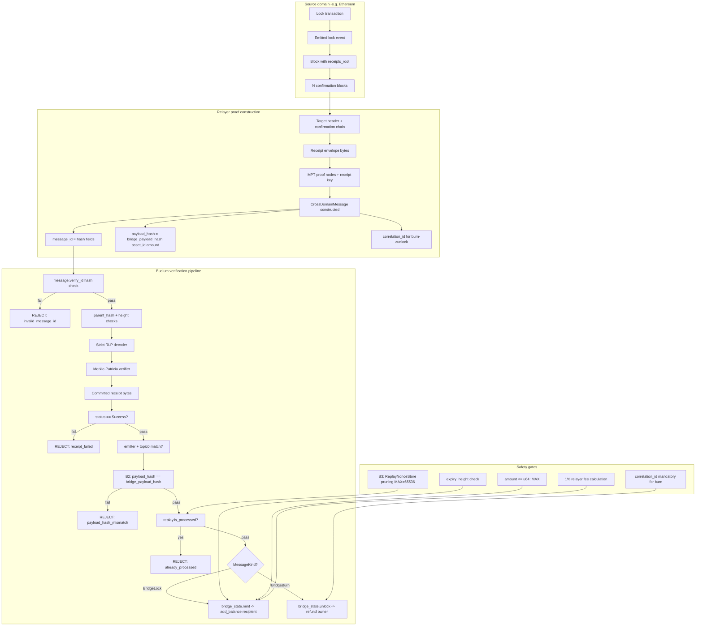

## 16. AI inference + execution proof — full lifecycle with STARK

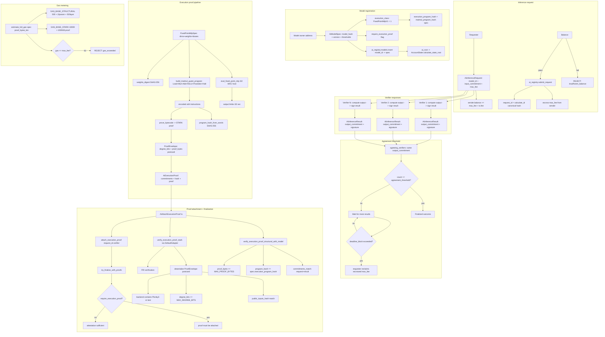

## 17. Consensus finality — all 5 domain adapters

```mermaid
flowchart TD
  subgraph sg20[PoW domain adapter]

    PowCommit["DomainCommitment: domain_block_hash + cumulative_work"]
    PowProof["FinalityProof::PoW: nonce + extra_nonce"]
    PowVerify["verify: declared_head_hash == commitment.domain_block_hash"]
    PowVerify --> WorkCheck[cumulative_work internal consistency]
    WorkCheck --> MinWork[min_work threshold check]
  end

  subgraph sg21[PoS domain adapter]

    PosCommit["DomainCommitment: validators_root + epoch"]
    PosProof["FinalityProof::PoS: BLS certificate"]
    PosVerify[verify: cert.verify BLS aggregate signature]
    PosVerify --> SignerCheck[signers ⊆ validator_set]
    SignerCheck --> Threshold["2/3+ stake threshold"]
    PosVRF[VRF: calculate_seed -> validator selection]
    PosVRF --> SeedRisk[C2: poison fallback -> predictable seed]
  end

  subgraph sg22[BFT domain adapter]

    BftCommit["DomainCommitment: round + state_hash"]
    BftProof["FinalityProof::BFT: BLS certificate"]
    BftVerify[verify: BLS cert with signer_count]
    BftVerify --> QuorumCheck[quorum threshold met]
  end

  subgraph sg23[ZK domain adapter]

    ZkCommit["DomainCommitment: proof_hash + program_hash"]
    ZkProof["FinalityProof::ZK: STARK ProofEnvelope"]
    ZkVerify[verify: ProofClaimRegistry first-valid-wins]
    ZkVerify --> StarkCheck["DefaultAdapter::verify envelope"]
    StarkCheck --> PublicInputs[public_inputs_hash match]
  end

  subgraph sg24[PoA domain adapter -isolated]

    PoaCommit["DomainCommitment: authorities_root + round"]
    PoaProof["FinalityProof::PoA: authorities + signatures vec"]
    PoaVerify[verify: ed25519 signature set]
    PoaVerify --> PoaMsg[poa_commit_signing_message commitment-bound]
    PoaMsg --> QuorumPoa[quorum count met no stake]
    PoaIsolation[PoA NO stake in PermissionlessRegistry]
    PoaIsolation --> SeparateReg[PoaMembershipRegistry KYC-only]
  end

  subgraph sg25[Global settlement]

    PowVerify --> Global["GlobalBlockHeader 12+ roots"]
    PosVerify --> Global
    BftVerify --> Global
    ZkVerify --> Global
    PoaVerify --> Global
    Global --> DomainSep[BDLM_GLOBAL_BLOCK_V2 domain separation]
    Global --> Seal[seal_global_header operator-only RPC]
  end
```

## 18. Registry — complete stake + slash + unbond state machine

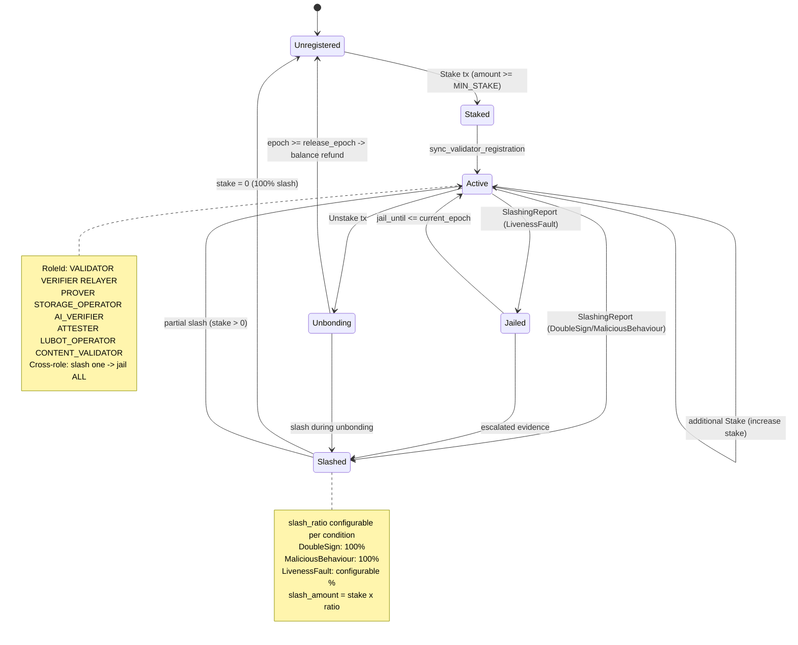

## 19. Wallet — complete signing + privacy + TEE pipeline

```mermaid
flowchart TD
  subgraph sg26[Key derivation]

    Entropy[CSPRNG 16/32 bytes getrandom] --> Mnemonic[BIP39 2048-word English wordlist]
    Mnemonic --> Checksum[checksum verify: SHA256 first N bits]
    Mnemonic --> Seed[PBKDF2-HMAC-SHA512 2048 iterations -> 32 bytes]
    Seed --> SLIP10[SLIP-10 Ed25519 hardened HD m/44'/coin'/account']
    SLIP10 --> SigningKey[ed25519_dalek SigningKey]
    SigningKey --> VerifyingKey[VerifyingKey 32 bytes]
    VerifyingKey --> Address[SHA3-256 -> BudlumAddress]
  end

  subgraph sg27[V4 transaction signing]

    Payload[Transaction payload] --> Canonical[canonical_signing_hash V4]
    Canonical --> Fields["chain_id + nonce + to + amount + fee + data + type"]
    Fields --> Preimage[SHA3-256 domain-separated preimage]
    Preimage --> Ed25519Sign[SigningKey.sign preimage]
    Ed25519Sign --> Signature[ed25519 Signature 64 bytes]
    Signature --> Tx["Transaction: payload + signature + V4 marker"]
  end

  subgraph sg28[Privacy key derivation]

    Seed --> SpendSecret[derive_spend_secret seed // commitment -> u64]
    Seed --> Blinding[derive_blinding seed // counter -> u64]
    Seed --> ViewKey[derive_view_key seed // 0xVIEW -> 32 bytes]
    SpendSecret --> Nullifier[Poseidon2 secret DOMAIN_NULLIFIER]
    Blinding --> Commit[Poseidon3 amount blinding recipient_tag]
  end

  subgraph sg29[TEE execution-time confidentiality]

    TeeConfig[TeeBackendKind: None/ClientSgx/ServerNitro]
    TeeConfig -->|None| NoTee[Plaintext signing path]
    TeeConfig -->|Sgx/Nitro| TeeRuntime[TeeRuntime.seal_private_intent]
    TeeRuntime -->|available| Sealed[Sealed intent -> enclave]
    TeeRuntime -->|unavailable| FailClosed[FAIL-CLOSED: refuse plaintext]
  end

  subgraph sg30[Memory safety]

    Drop["Wallet::drop"] --> ZeroizeMnemonic[mnemonic.zeroize]
    Drop --> ZeroizeSeed[seed.zeroize]
    Drop --> ZeroizeKey[signing_key zeroize internal]
  end

  subgraph sg31[Social recovery]

    Guardians["GuardianApproval: threshold + timelock"] --> Proposal[RecoveryProposal]
    Proposal --> Digest[BDLM_WALLET_RECOVERY_PROPOSAL_V1 domain-separated]
    Proposal --> Timelock["executable_after = created_block + timelock"]
    Proposal --> Rotate[rotate_guardian for compromised]
  end
```

## 20. BudZero STARK — bytecode to verified proof pipeline

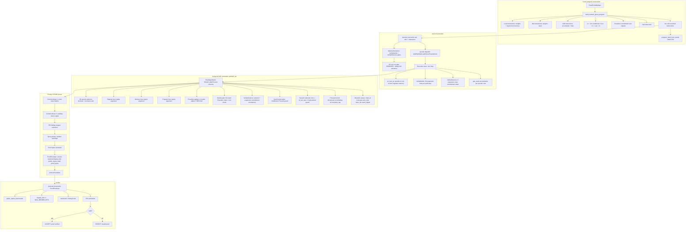

## 21. Governance — proposal to execution pipeline

```mermaid
flowchart TD
  subgraph sg37[Proposal creation]

    Proposer[Proposer address] --> Type{ProposalType?}
    Type -->|ChangeBlockReward| P1[value: new reward amount]
    Type -->|ChangeFeeParams| P2[value: new fee parameters]
    Type -->|SetConstitutionParameter| P3["key + value bounded"]
    Type -->|SetEncryptionPolicy| P4["policy: version + suite + limits"]
    P1 --> Gov[governance.proposals.push]
    P2 --> Gov
    P3 --> Gov
    P4 --> Gov
    Gov --> Epoch["start_epoch + end_epoch"]
    Gov --> Activation[activation_epoch timelock]
  end

  subgraph sg38[Voting period]

    Epoch --> Active[Active status]
    Active --> Vote[Voter: stake-weighted]
    Vote --> For["votes_for += voter.stake"]
    Vote --> Against["votes_against += voter.stake"]
    Vote --> Snapshot[voter_weights snapshot]
    Snapshot --> Unstake[Unstake during voting -> reduce_vote_weight]
    Active --> Cancel[cancel_proposal owner-only]
  end

  subgraph sg39[Epoch advance - finalize]

    EndEpoch["current_epoch >= end_epoch"] --> Finalize[proposal.finalize]
    Finalize --> TotalStake[total_stake = get_total_stake]
    TotalStake --> Quorum[quorum_pct = 33%]
    Quorum --> Check{votes >= quorum AND for > against?}
    Check -->|yes| Passed[Status: Passed]
    Check -->|no| Rejected[Status: Rejected]
  end

  subgraph sg40[Activation - execute]

    Passed --> ActCheck["current_epoch >= activation_epoch?"]
    ActCheck -->|yes| Execute[execute_proposal]
    ActCheck -->|no| Wait[Wait for activation]
    Execute -->|ChangeBlockReward| SetReward[block_reward = new_value]
    Execute -->|ChangeFeeParams| SetFee[fee_params = new_value]
    Execute -->|SetConstitutionParameter| SetConst[parameter update with whitelist check]
    Execute -->|SetEncryptionPolicy| SetEnc[encryption_policies.insert DAO-managed]
    Execute --> Whitelist[GOVERNANCE_PARAMETER_WHITELIST validation]
    Whitelist -->|not whitelisted| RejectParam[REJECT: non_whitelisted_parameter]
  end
```

## 22. Tokenomics — burn + vesting + reward state machine

```mermaid
flowchart TD
  subgraph sg41[Genesis allocation -100M BUD, 6 decimals]

    Total[100_000_000 x BUD_UNIT] --> Community[10M -> community accounts]
    Total --> Liquidity[10M -> liquidity accounts]
    Total --> Ecosystem[20M -> ecosystem accounts]
    Total --> Team["20M -> team_vesting cliff+linear"]
    Total --> BurnReserve[40M -> burn_reserve_address]
  end

  subgraph sg42[process_timed_burn -epoch-triggered]

    Epoch[advance_epoch] --> Trigger[process_timed_burn called]
    Trigger --> Rate[annual_burn_rate x BUD_UNIT / epochs_per_year]
    Rate --> BurnFrom[burn_from burn_reserve_address amount]
    BurnFrom --> Supply[circulating_supply decreases]
    BurnFrom --> Exhausted{reserve == 0?}
    Exhausted -->|yes| Stop[Stop burning]
    Exhausted -->|no| Continue[Continue next epoch]
  end

  subgraph sg43[Metabolic tx-fee burn]

    Tx[Transaction applied] --> Fee[tx.fee collected]
    Fee --> Ratio[tx_fee_burn_ratio x fee]
    Ratio --> BurnFee[burn_from sender amount]
    Fee --> Remainder[remainder -> proposer/treasury]
  end

  subgraph sg44[Team vesting -cliff + linear]

    TeamAlloc[20M team allocation] --> Cliff[cliff_epochs: no unlock]
    Cliff --> Linear[linear unlock per epoch after cliff]
    Linear --> Spendable["spendable_balance = balance - locked_at epoch"]
    Spendable --> Transfer{transfer amount <= spendable?}
    Transfer -->|yes| Allow[Transfer allowed]
    Transfer -->|no| RejectVest[REJECT: vesting_locked]
  end

  subgraph sg45[Supply cap enforcement -V144]

    BlockReward[block_reward mint] --> CapCheck["total_bud_committed <= 100M?"]
    CapCheck -->|yes| Mint[Allow mint]
    CapCheck -->|no| CapReject[REJECT: supply_cap_exceeded]
    TotalBud["total_bud_committed = circulating + staked + unbonding"]
    TotalBud --> CapCheck
  end

  subgraph sg46[Fee market -EIP-1559]

    BaseFee[block N-1 base_fee] --> Adjust[±12.5% based on gas usage]
    Adjust --> NewBase[block N base_fee]
    Tx2[Transaction] --> Effective["effective_fee = min max_fee base_fee+priority"]
    Effective --> Burn2[base_fee portion burned]
    Effective --> Tip[priority_fee -> proposer]
  end
```

## 23. P2P protocol stack — libp2p to application

```mermaid
flowchart TD
  subgraph sg47[Transport layer]

    TCP[TCP /ip4/0.0.0.0/tcp/4001]
    QUIC[QUIC /ip4/0.0.0.0/udp/4001/quic-v1]
    Identity[Ed25519 PeerId identity key]
    TCP --> Libp2p[libp2p Swarm]
    QUIC --> Libp2p
    Identity --> Libp2p
  end

  subgraph sg48[Peer discovery]

    Kademlia[Kademlia DHT]
    Bootstrap[Bootstrap nodes from config]
    DNS[Dns seed resolution]
    Kademlia --> Peers[PeerManager known peers]
    Bootstrap --> Kademlia
    DNS --> Bootstrap
  end

  subgraph sg49[Gossipsub messaging]

    Topics[Topic: blocks txs finality snapshots]
    MsgIn[Incoming message] --> Dedup[MessageId dedup SipHash]
    Dedup --> Validate[Message validation]
    Validate --> SizeCheck[MAX_MESSAGE_SIZE 10MB]
    SizeCheck -->|oversized| Score1[report_oversized_message penalty]
    SizeCheck -->|ok| Dispatch[Dispatch to handler]
    Dispatch --> BlockHandler[block received -> validate_and_add_block]
    Dispatch --> TxHandler[tx received -> mempool admission]
    Dispatch --> FinalityHandler[finality cert -> apply_qc_fault_verdict]
  end

  subgraph sg50[Reputation scoring]

    Score[PeerScore: -100 to 100]
    Score --> Good["Valid block/tx relay: +reward"]
    Score --> Bad1[Invalid block: report_invalid_block penalty]
    Score --> Bad2[Invalid tx: report_invalid_tx penalty]
    Score --> Bad3[Oversized msg: report_oversized_message penalty]
    Score --> RateLimit[Rate limit exhaustion: dedicated penalty]
    Score --> Ban{score <= -100?}
    Ban -->|yes| BanPeer["Ban peer + disconnect"]
    Ban -->|no| Continue[Continue connection]
    Eclipse[max_peers_per_subnet /24 = 4] --> Score
    Eclipse --> Idempotent[note_connected/disconnected idempotent]
  end

  subgraph sg51[Snapshot synchronization]

    SnapReq[Snapshot request] --> Chunks[MAX_SNAPSHOT_CHUNKS = 4096]
    Chunks --> Concurrent[MAX_CONCURRENT_SNAPSHOTS = 10]
    Chunks --> Verify["Schema-4 digest + field manifest verify"]
    Verify --> Restore[Restore AccountState]
    Verify --> Quarantine[Quarantine on failure]
  end
```

## 24. Pollen data marketplace — full grant + encryption + AI gate

```mermaid
flowchart TD
  subgraph sg52[DataAsset registration]

    Owner[Data owner address] --> Asset["DataAsset: asset_id + metadata"]
    Asset --> Registry[MarketplaceRegistry.data_assets.insert]
    Asset --> Root1[data_assets_root -> Pollen root -> state_root]
  end

  subgraph sg53[AccessGrant lifecycle]

    Asset --> Grant["AccessGrant: grant_id + grantee + scope + expiry + max_reads"]
    Grant --> GrantReg[MarketplaceRegistry.access_grants.insert]
    Grant --> Root2[access_grants_root -> Pollen root]
    Grant --> Revoke[Revoke: owner-only -> remove from registry]
    Grant --> Expire["Expiry: block > expiry_block -> invalid"]
    Grant --> Exhaust[max_reads reached -> exhausted]
  end

  subgraph sg54[SaleAuthorization + purchase]

    Asset --> Sale["SaleAuthorization: seller + buyer + price + duration"]
    Sale --> SaleReg[MarketplaceRegistry.sale_authorizations.insert]
    Sale --> Purchase["PollenPurchaseReceipt: seller auth + buyer + grant + payment"]
    Purchase --> IssueGrant[issue_grant_from_sale_authorization]
    IssueGrant --> NewGrant[New AccessGrant for buyer]
    Purchase --> ReceiptReg[purchase_receipts.insert -> root]
  end

  subgraph sg55[EncryptionPolicy -DAO-managed]

    DAO[Governance proposal] --> SetPolicy[SetEncryptionPolicy action]
    SetPolicy --> Policy["EncryptionPolicy: version + hpke_suite + min_key + max_duration"]
    Policy --> PolicyReg[MarketplaceRegistry.encryption_policies.insert]
    Policy --> NoDecrypt[NO decrypt/key/read override fields]
    Policy --> AssetPolicy[AssetEncryptionPolicy per-asset]
    AssetPolicy --> Validate["validate_static: algorithm + key_length + rotation"]
    Validate --> RejectNone["EncryptionAlgorithm::None REJECTED"]
  end

  subgraph sg56[AI inference data gate]

    Req[AiInferenceRequest] --> InputRef["input_ref: Pollen data reference?"]
    InputRef -->|no poll| Legacy[Legacy opaque path - no grant needed]
    InputRef -->|yes poll| GrantCheck{valid AccessGrant exists?}
    GrantCheck -->|no grant| Deny1[REJECT: ai_data_access_denied]
    GrantCheck -->|expired| Deny2[REJECT: grant_expired]
    GrantCheck -->|revoked| Deny3[REJECT: grant_revoked]
    GrantCheck -->|exhausted| Deny4[REJECT: grant_exhausted]
    GrantCheck -->|wrong grantee| Deny5[REJECT: grantee_mismatch]
    GrantCheck -->|valid| Allow[ALLOW: data read permitted]
    Allow --> Consume[Increment read count]
    Consume --> FailCheck[Failed request does NOT consume grant]
  end

  subgraph sg57[D-Web Passport evidence]

    BNSName[BNS name] --> Profile[DwebPassportProfile]
    Profile --> Evidence[EvidenceCard: BNS verified/expired]
    Profile --> PollenSummary[Pollen lineage counts]
    Profile --> Bundle[PassportProofBundle deterministic root]
    Bundle --> Warning[Warning hash only - NO plaintext]
    Profile --> RPC[bud_passportGetProfile read-only]
    Bundle --> RPC2[bud_passportGetProofBundle read-only]
  end
```

## 25. Cross-domain message verification — EVM MPT deep dive

```mermaid
flowchart TD
  subgraph sg58[Target chain header validation]

    BlockNum[block_number] --> Height["source_height >= deployment_height"]
    ParentHash[parent_hash] --> Chain[chain continuity check]
    Confirm[N confirmations] --> Depth["depth >= min_confirmations"]
    ReceiptsRoot[receipts_root] --> MPT[MPT root for proof verification]
    StateRoot[state_root] --> AccRoot[account state verification]
  end

  subgraph sg59[Strict RLP decoding]

    Bytes[Receipt envelope bytes] --> Prefix[RLP prefix byte]
    Prefix -->|0xf7..0xff| List[RLP list header]
    Prefix -->|0x80..0xb7| String[RLP string]
    List --> Status[Status field: 0x0 = fail 0x1 = success]
    List --> Logs[Logs array]
    Logs --> Topic0[topic0: event signature]
    Logs --> Emitter["Emitter address: known contract?"]
    Logs --> Data[Data: payload bytes]
  end

  subgraph sg60[Merkle-Patricia trie verification]

    Key[RLP encode receipt index] --> Nibble[Convert to nibbles]
    Nibble --> Root[Start at receipts_root]
    Root --> Node{Node type?}
    Node -->|Branch| Branch["16 children + value"]
    Node -->|Extension| Extension["shared nibbles + next"]
    Node -->|Leaf| Leaf["remaining nibbles + value"]
    Branch --> Match[Match next nibble -> child]
    Extension --> Shared[Verify shared prefix matches]
    Leaf --> Remain[Verify remaining nibbles match]
    Match --> Next[Recurse into child node]
    Shared --> Next
    Remain --> Value[Extract leaf value = receipt bytes]
  end

  subgraph sg61[Payload verification]

    Value --> DecodeReceipt[Decode receipt bytes]
    DecodeReceipt --> StatusCheck{status == 0x1 success?}
    StatusCheck -->|no| Reject1[REJECT: transaction_failed]
    StatusCheck -->|yes| EmitterCheck{emitter in allowlist?}
    EmitterCheck -->|no| Reject2[REJECT: unknown_emitter]
    EmitterCheck -->|yes| TopicCheck{topic0 matches expected event?}
    TopicCheck -->|no| Reject3[REJECT: wrong_event_type]
    TopicCheck -->|yes| PayloadHash["B2: payload_hash == bridge_payload_hash asset_id amount"]
    PayloadHash -->|fail| Reject4[REJECT: payload_hash_mismatch]
    PayloadHash -->|pass| Accept[ACCEPT: verified deposit/lock facts]
  end
```
## 26. Privacy layer — note lifecycle (D2)

```mermaid
flowchart LR
  Seed[Wallet seed] --> Derive["derive_spend_secret + derive_blinding"]
  Derive --> Note[PrivateNoteInput / PrivateNoteOutput]
  Note --> Commit[PrivacyCommit opcode -> Poseidon3]
  Commit --> Reg[L1NoteRegistry live_commitments]
  Note --> Null[NullifierCheck opcode -> Poseidon2]
  Null --> Spent[spent_nullifiers set]
  Reg --> Transfer[PrivateTransferSubmit tx]
  Transfer --> Verify[SumConservation opcode]
  Transfer --> Apply["apply_transfer: remove commitment + insert nullifier"]
  ViewKey[View key disclosure] -. selective .-> Audit[Auditor / authority]
  TEE[TEE opt-in] -. encrypt .-> Note
```

## 27. Wallet-core architecture

```mermaid
flowchart TD
  Entropy[CSPRNG entropy] --> BIP39[BIP39 mnemonic 12/24 words]
  BIP39 --> Seed[PBKDF2 -> 32-byte seed]
  Seed --> SLIP10[SLIP-10 Ed25519 HD derivation]
  SLIP10 --> KeyPair["SigningKey + VerifyingKey"]
  KeyPair --> Address[SHA3-256 -> BudlumAddress]
  KeyPair --> Sign[V4 canonical signing]
  Seed --> Privacy[derive_spend_secret / derive_blinding]
  Seed --> ViewKey[derive_view_key]
  TEE[TeeRuntime opt-in] -. seal .-> Sign
  Zeroize[Zeroize on drop] -. cleanup .-> Seed
  Zeroize -. cleanup .-> BIP39
  Recovery[Social recovery guardians] -. restore .-> Seed
```

## 28. Governance lifecycle

```mermaid
flowchart LR
  Propose[Proposal submitted] --> Active[Active voting period]
  Active --> Vote[Stake-weighted votes for/against]
  Active --> Timelock[activation_epoch timelock]
  Vote --> Finalize[Epoch advance -> finalize]
  Finalize -->|quorum met + majority| Passed[Passed]
  Finalize -->|quorum not met| Rejected[Rejected]
  Passed --> Execute[Execute governance action]
  Timelock --> Execute
  Execute --> Params[Update chain parameters]
  Execute --> BlockReward[Change block reward]
  Execute --> Constitution[Update constitution guardrails]
  Cancel[Proposal cancellation] -. owner only .-> Active
```

## 29. Tokenomics flow

```mermaid
flowchart TD
  Genesis[100M BUD genesis] --> Community[Community 10M]
  Genesis --> Liquidity[Liquidity 10M]
  Genesis --> Ecosystem[Ecosystem 20M]
  Genesis --> Team["Team 20M vesting cliff+linear"]
  Genesis --> BurnReserve[Burn reserve 40M]
  BurnReserve --> TimedBurn[process_timed_burn epoch-triggered]
  TxnFee[Tx fee] --> FeeBurn[tx_fee_burn_ratio metabolic burn]
  TxnFee --> Proposer[Proposer tip]
  TxnFee --> Treasury[Treasury share]
  BlockReward[block_reward mint] --> Proposer2[Block producer]
  TimedBurn --> Sink[Burn sink - supply decreases]
  FeeBurn --> Sink
```

## 30. P2P network topology

```mermaid
flowchart TB
  Node[Budlum node] --> Gossip[Gossipsub topics]
  Gossip --> Blocks[Block announcements]
  Gossip --> Txs[Transaction relay]
  Gossip --> Finality[Finality certificates]
  Node --> Peers[PeerManager]
  Peers --> MaxPeers[MAX_PEERS = 50]
  Peers --> Subnet[max_peers_per_subnet /24 = 4]
  Peers --> Score[Reputation scoring]
  Score --> Ban[Ban threshold <= -100]
  Node --> Snap[Snapshot sync]
  Snap --> Chunks[MAX_SNAPSHOT_CHUNKS = 4096]
  Snap --> Concurrent[MAX_CONCURRENT_SNAPSHOTS = 10]
  Node --> Identity[Ed25519 identity key]
  Identity --> Auth[Peer authentication]
```

## 31. Permissionless registry architecture

```mermaid
flowchart LR
  Stake[Stake tx] --> Reg[PermissionlessRegistry]
  Reg --> Roles[RoleId: VALIDATOR - VERIFIER - RELAYER - PROVER - STORAGE_OPERATOR - AI_VERIF...]
  Reg --> Slash[SlashingReport -> slash]
  Slash --> DoubleSign[DoubleSign -> 100%]
  Slash --> Liveness[LivenessFault -> configurable]
  Slash --> Malicious[MaliciousBehaviour -> 100%]
  Reg --> Unbond[Unbond tx -> unbonding_queue]
  Unbond --> Epoch[Epoch advance -> release]
  CrossRole[Cross-role slashing] -. slash one .-> AllRoles[All roles jailed]
```

## 32. PoA domain lifecycle

```mermaid
flowchart LR
  KYC[KYC / identity verification] --> Membership[PoaMembershipRegistry]
  Membership --> Admin[Admin approval]
  Admin --> Active[Active PoA member]
  Active --> Sign[Ed25519 finality signatures]
  Active --> Compliance[PoaComplianceRegistry]
  Compliance --> Screen[Address screening]
  Compliance --> Freeze[Asset freeze]
  Compliance --> TravelRule[Travel rule metadata hash]
  Compliance --> Audit[Append-only audit log]
  Isolation[PoA isolated from permissionless domains] -. no shared registry .-> Permissionless
```

## 33. Validator lifecycle — multi-role architecture

```mermaid
flowchart TD
  Genesis[Genesis config] --> Val[Validator created with keys]
  Stake[Stake tx] --> Active[Active validator]

  subgraph sg1[Role 1 - Consensus Validation]
    Active --> Propose[Block proposal via VRF]
    Active --> Finality[BLS finality signing]
    Active --> Witness[Epoch witness + vote]
    Propose --> ConsensusReward[Block reward + fee tip]
    Finality --> FinalityReward[Finality signing reward]
  end

  subgraph sg2[Role 2 - Lubot CPU/System Provider]
    Active --> LubotBond[LUBOT_OPERATOR role bond]
    LubotBond --> LubotCompute[CPU/GPU compute for AI inference]
    LubotCompute --> LubotServe[Serve Lubot inference requests]
    LubotServe --> LubotReward[Inference service reward]
    LubotServe --> LubotSlash[Compute fault -> slash]
  end

  subgraph sg3[Role 3 - B.U.D. Storage Verification]
    Active --> StorageBond[STORAGE_OPERATOR role bond]
    StorageBond --> StorageStore[Store content shards]
    StorageStore --> StorageChallenge[Respond to retrieval challenges]
    StorageChallenge --> StorageProof[VerifyMerkle 64-depth proof]
    StorageProof --> StorageReward[Storage operator reward]
    StorageChallenge --> StorageSlash[Challenge failure -> slash]
  end

  subgraph sg4[Cross-Role Slashing]
    Slash[Slashing evidence] --> Jailed[Jailed until epoch N]
    LubotSlash --> Jailed
    StorageSlash --> Jailed
    Jailed --> Release[Jail release]
    Release --> Active
    Liveness[Missed epochs > threshold] --> LivenessSlash[Liveness report -> slash all roles]
    CrossRole[Slash one role -> jail ALL roles]
  end

  Unstake[Unstake tx] --> Unbonding[Unbonding queue]
  Unbonding --> Epoch[Epoch advance -> release stake]
```

## 34. Pollen data rights lifecycle

```mermaid
flowchart LR
  Asset[DataAsset registered] --> Grant[AccessGrant issued]
  Grant --> Grantee["Grantee address + scope + expiry"]
  Asset --> Sale[SaleAuthorization]
  Sale --> Buyer[Buyer purchases access]
  Buyer --> Purchase[PollenPurchaseReceipt]
  Grant --> AI[AI inference request]
  AI --> Gate[Pollen data gate: valid grant required]
  Gate -->|grant valid| Allow[Allow data read]
  Gate -->|no grant| Deny[Deny - strict default-deny]
  Encrypt[EncryptionPolicy DAO-managed] -. parameters .-> Asset
  Revoke[Revoke grant/asset] -. owner only .-> Grant
```

## 35. Relayer policy layer

```mermaid
flowchart LR
  User[User intent] --> Intent[UserIntent signed]
  Intent --> Pool[Intent pool]
  Pool --> Solver[Solver bids]
  Solver --> Best[Best bid selection]
  Best --> Settle[IntentSettlement]
  Settle --> Execute[Execute settlement]
  Policy[PolicyEnvelope] --> FeeCap[Fee cap enforcement]
  Policy --> Deadline[Deadline validation]
  Policy --> Domain[Domain allowlist]
  Policy --> Replay[Replay nonce check]
  Slashing[Relayer slashing] --> Griefing[Griefing -> 100%]
  Slashing --> FrontRunning[Front-running -> 100%]
  Slashing --> WrongRelay[Wrong-relay -> 100%]
```

## 36. Fee market (EIP-1559)

```mermaid
flowchart LR
  Block[Block N-1 base_fee] --> Calc[next_base_fee calculation]
  Calc --> Adjustment[±12.5% adjustment based on gas usage]
  Adjustment --> BaseFee[Block N base_fee]
  Tx[Transaction] --> Bid["FeeBid: max_fee + max_priority_fee"]
  Bid --> Effective["effective_fee = min(max_fee, base_fee + priority)"]
  Effective --> Check["effective_fee >= base_fee?"]
  Check -->|yes| Accept[Accepted]
  Check -->|no| Reject[Rejected - underpriced]
  Accept --> Burn[base_fee burned]
  Accept --> Tip[priority_fee -> proposer]
```

## 37. AI execution proof pipeline

```mermaid
flowchart TD
  Model[FixedPointMlpSpec] --> Host[Host eval_fixed_point_mlp i32 MAC]
  Host --> Output[Output limbs]
  Model --> Guest[build_matmul_guest_program BudZKVM instructions]
  Guest --> ProgramHash[program_hash_from_words]
  Model --> Weights[weights_digest SHA3-256]
  Weights --> Bytecode["Guest bytecode: Load + Mul + Add + ReLU + Poseidon + Halt"]
  Bytecode --> Prove[prove_bytecode -> STARK proof]
  Prove --> Envelope[ProofEnvelope postcard]
  Envelope --> Attach[AiAttachExecutionProof tx]
  Attach --> Verify["Structural verify + program_hash bind"]
  Verify --> STARK[STARK verify via DefaultAdapter]
  STARK --> Finalize[try_finalize_with_proofs]
```

## 38. DeEd content manifest architecture

```mermaid
flowchart LR
  Content[Raw content bytes] --> Hash[ContentId = SHA3-256 domain-tagged]
  Content --> Shards[Off-chain sharding]
  Shards --> ShardRef["ShardRef: shard_id + size"]
  Hash --> Manifest["ContentManifest: shards + metadata + owner"]
  Manifest --> ManifestId[ManifestId = deterministic hash]
  ManifestId --> Chain[On-chain registration]
  Chain --> Deal[Storage deal per shard]
  Deal --> Operator[Storage operator bonds]
  Deal --> Challenge[Retrieval challenge]
  Challenge --> Proof[VerifyMerkle 64-depth proof]
  Roles[Permissionless roles: STORAGE_OPERATOR - ATTESTER] -. no whitelist .-> Deal
```

## 39. BNS (Budlum Name Service) lifecycle

```mermaid
flowchart LR
  Register[Register name 3-32 chars] --> Cost[Cost = base x multiplier x duration]
  Cost --> Owner[Owner address bound]
  Owner --> Resolve[resolve_content -> address]
  Owner --> SetContent[set_content -> CID/hash]
  Owner --> Transfer[Transfer to new owner]
  Owner --> Renew[Renew before expiry]
  Expiry[Expiry epoch reached] --> Grace[Grace period 3000 epochs]
  Grace -->|original owner| Renew2[Renew only by original owner]
  Grace -->|expired| Available[Name available for re-registration]
  Squat[Front-running squatting protection] -. grace period .-> Grace
```

## 40. SocialFi NFT lifecycle

```mermaid
flowchart LR
  Mint[Mint NFT owner-only] --> Metadata["CID + luminance=0"]
  Metadata --> Luminance[update_luminance delta i128]
  Luminance --> Positive[Positive: amplify reach]
  Luminance --> Negative[Negative: reduce reach]
  Mint --> Transfer[Transfer to new owner]
  Mint --> Burn[Burn -> CID returned]
  Registry[NftRegistry next_id auto-increment] --> Mint
  Guard[Luminance clamp i128 -> safe range] --> Luminance
```

## 41. Hub app registry

```mermaid
flowchart LR
  Developer[Developer address] --> Register[register_app auto-increment ID]
  Register --> Manifest["AppManifest: URL + metadata"]
  Manifest --> Update[update_app URL/manifest]
  Register --> SelfVerify[verify_app developer self-verify]
  SelfVerify --> Attested[developer_attested = true]
  Attested --> Verified[verified = true DAO override reserved]
  Root[Registry root hash] --> StateRoot[AccountState state_root]
  Audit[Attestation audit trail] --> SelfVerify
```

## 42. Mempool internals

```mermaid
flowchart TD
  Tx[Incoming transaction] --> Decode["V4 decode + signature verify"]
  Decode --> Admit["Admission: nonce + balance + type rules"]
  Admit --> Pool[Mempool pool max_size=20000]
  Pool --> PerSender[max_per_sender=100]
  Pool --> Evict[evict_lowest_fee when full]
  Pool --> RBF[Replace-By-Fee: higher fee replaces]
  Pool --> Dedup[Duplicate tx rejection]
  Pool --> Select[Block producer selects by fee priority]
  Select --> Block[Included in next block]
  Select --> Expire[Stale tx removed after N blocks]
```

## 43. Developer OS / SDK architecture

```mermaid
flowchart LR
  Manifest[DeveloperOsManifest deterministic] --> Project["Project ID + labels"]
  Project --> DevNet[Local devnet topology]
  Project --> BudL[BudL package fixtures]
  Project --> Proof[Proof fixtures]
  Project --> Pollen[Pollen fixtures]
  Project --> Relayer[Relayer policy fixtures]
  Manifest --> Flags[SDK feature flags]
  Flags --> Offline[Offline default: no external network]
  Flags --> Safety[Safety fixtures: verified proof required]
  Safety --> NoMock[Pollen fixture cannot bypass AI grant]
  Project --> Traversal[Path traversal rejection]
```

## 44. Gateway — Atlas + Passport evidence

```mermaid
flowchart LR
  Address[BudlumAddress] --> Atlas[AtlasWalletContext]
  Atlas --> Account[Account state evidence]
  Atlas --> Pollen[Pollen lineage summary]
  Atlas --> Domain["Domain trace + wallet graph"]
  Name[BNS name] --> Passport[DwebPassportProfile]
  Passport --> Evidence[EvidenceCard: verified/expired/pending]
  Passport --> Bundle[PassportProofBundle deterministic root]
  Bundle --> Warning[Warning hash only - no plaintext]
  Atlas --> RPC[bud_atlasGetWalletContext read-only]
  Passport --> RPC2[bud_passportGetProofBundle read-only]
  NoPlaintext[Endpoint never returns raw data] -. enforced .-> RPC
  NoPlaintext -. enforced .-> RPC2
```

## 45. Settlement commitment tree

```mermaid
flowchart TD
  Block[Block commitment] --> Roots["12+ root fields"]
  Roots --> DomainReg[domain_registry_root]
  Roots --> Commitment[commitment_root]
  Roots --> Message[message_root]
  Roots --> Bridge[bridge_root]
  Roots --> Replay[replay_root]
  Roots --> Settlement[settlement_root]
  Roots --> Storage[storage_root]
  Roots --> AI[ai_root]
  Roots --> Pollen[pollen_root]
  DomainSep[BDLM_GLOBAL_BLOCK_V2 domain separation] --> Hash[GlobalBlockHeader hash]
  Proof[SettlementProofVerifier] --> Merkle["Merkle proof + domain/height/index check"]
  Merkle --> Forge[expected_block_hash forgery gate]
```

## 46. Prover market — proof verification

```mermaid
flowchart LR
  Task[ProofTask created] --> Assign[Assigned to prover]
  Assign --> Prove[Prover generates STARK proof]
  Prove --> Receipt["ProofReceipt: task_id + prover + hash + reward"]
  Receipt --> Verify["Verification: task_id + prover + epoch + hash + reward cap"]
  Verify -->|valid| Complete[complete_task -> reward committed]
  Verify -->|invalid| Reject[Reject - task stays active]
  Policy[First valid receipt wins] --> Complete
  Policy --> Duplicate[Identical duplicate -> idempotent]
  Limits["Active tasks + pending receipts bounded"] --> Task
```

## 47. Sovereign domain kit

```mermaid
flowchart LR
  Template[SovereignDomainTemplate] --> Class[SovereignClass enum]
  Class --> PoA[EnterprisePoa -> requires PoA consensus]
  Class --> Custom[Custom class label validated]
  Template --> Compliance[ComplianceEvidence hash/root only]
  Compliance --> NoPII[No private KYC/passport on-chain]
  Template --> Lifecycle[Lifecycle: draft -> active -> retired]
  Lifecycle --> NoReactivate[Retired cannot re-activate]
  Template --> Audit["AuditExportBundle template + compliance root"]
  Audit --> Bounded[Bounded height span]
```

## 48. Constitution engine

```mermaid
flowchart TD
  Guardrails[Hard guardrails immutable] --> NoWhitelist[No permissionless whitelist]
  Guardrails --> NoDecrypt[No AI read/decrypt override]
  Guardrails --> PoAIsolation[PoA domain isolation]
  Guardrails --> NoCustody[No private key custody]
  Guardrails --> EvidenceOnly[Evidence-only API]
  Params[Mutable bounded params] --> HaltMax[emergency_halt_max_epochs]
  Params --> PropMin[constitution_proposal_min_epochs]
  Governance[SetConstitutionParameter proposal] --> Params
  Governance -->|hard guardrail update| Reject[Fail-closed rejected]
  Root[Constitution root hash] --> StateRoot[AccountState state_root]
```

## 49. Mobile self-hosting profile

```mermaid
flowchart LR
  Profile[MobileNodeProfile] --> Power[PowerMode: battery/saver/performance]
  Power --> Battery[BatteryStatus validated]
  Profile --> Network["NetworkStatus: bandwidth + latency + NAT"]
  Profile --> Storage["StorageStatus: capacity + availability"]
  Network --> Relay[Relay address for NAT traversal]
  Storage --> Critical[Critical content requires paid replica]
  Profile --> Opportunistic[Opportunistic hosting - not always-on]
  Profile --> Scheduled[Scheduled replication windows]
  Validation[Impossible battery state rejected] --> Battery
  Validation[Zero bandwidth rejected] --> Network
```

## 50. Encryption DAO policy lifecycle

```mermaid
flowchart LR
  DAO[Governance proposal] --> SetPolicy[SetEncryptionPolicy action]
  SetPolicy --> Policy["EncryptionPolicy: version + suite + limits"]
  Policy --> Active[active = true]
  Policy --> Deprecated[deprecated_after_block set]
  Policy --> MinKey[min_public_key_bytes enforced]
  Policy --> MaxGrant[max_grant_duration_blocks enforced]
  Policy --> NoDecrypt[No decrypt/key/read override fields]
  Asset[AssetEncryptionPolicy per-asset] --> Validate["validate_static: algorithm + key length + rotation"]
  Validate --> Reject["EncryptionAlgorithm::None rejected"]
  Root[Pollen root hash] --> StateRoot[AccountState state_root]
```

## 51. Pre-mortem security audit — attack graph

```mermaid
flowchart TD
  CIPat[CI PAT leak] --> MainBranch[main branch compromise]
  MainBranch --> CodeManip[Code manipulation]
  PKCS11[PKCS11 data object] --> BLSExtract[BLS key extraction]
  BLSExtract --> FinalityForge[Finality forge]
  BLSBias[BLS hash_to_g1 bias] --> FinalityManip[Finality manipulation]
  RPCNoAuth[RPC no auth] --> BridgeMint[Unauth bridge mint]
  BridgeNoPayload[Bridge mint no payload check] --> FundInflation[Fund inflation]
  SaturatingArith[saturating arithmetic] --> SilentLoss[Silent BUD loss]
  BlindingTrunc[Blinding truncation] --> PrivacyBreak[Privacy break]
  NullifierCollision[Nullifier collision] --> DoubleSpend[Double-spend]
  PoseidonDesync[Poseidon constants desync] --> AllProofsFail[All proofs rejected]
  SeedMemory[Seed in memory] --> TotalLoss[Total fund loss]
  C1 --> C1Fix[dual SHA3-256 LO/HI ✅]
  H1 --> H1Fix[Extractable=false ✅]
  R2 --> R2Fix[require_operator ✅]
  S1 --> S1Fix[register-based blinding ✅]
  B2 --> B2Fix[payload_hash verify ✅]
  E1 --> E1Fix[checked arithmetic ✅]
```
