# Budlum Mimari Atlası

> **Durum:** Kod haritası ve hedef mimariyi birlikte gösterir. Diyagramlardaki
> `feature-gated`, `planlı` ve `mainnet blocker` etiketleri tamamlanmış üretim
> özelliği iddiası değildir.

## 1. Genel sistem mimarisi

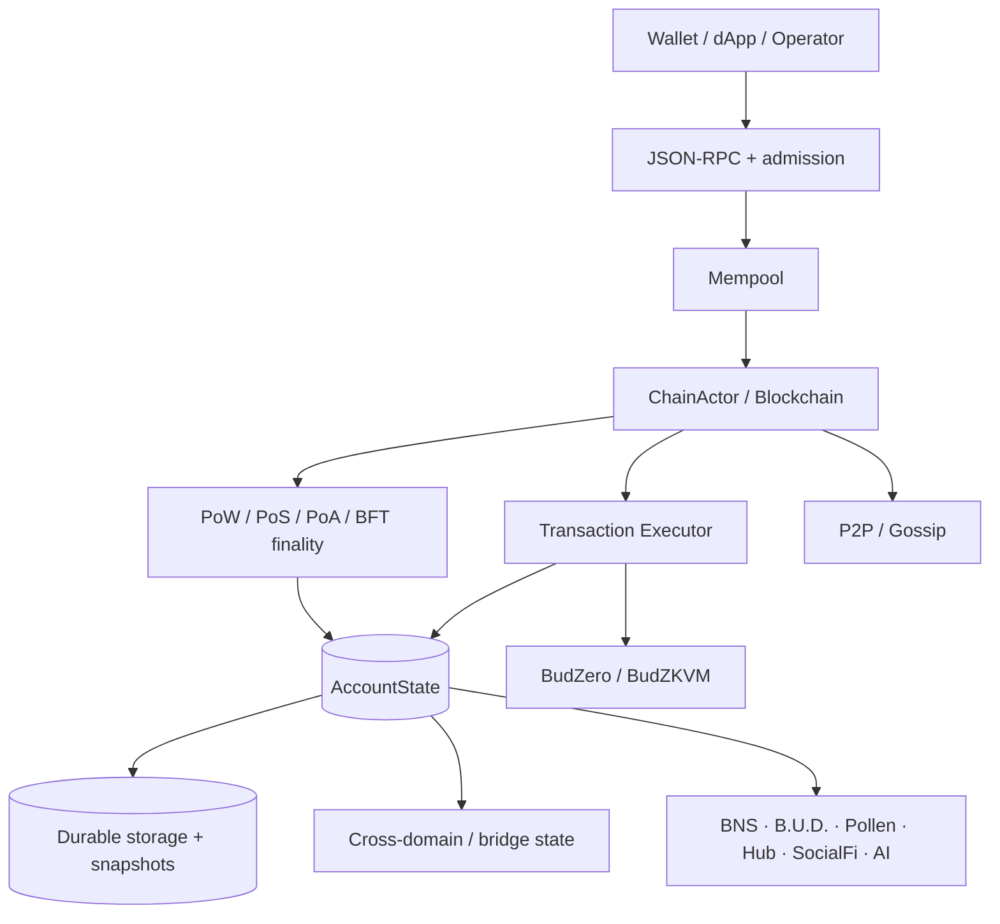

## 2. Consensus-domain izolasyonu

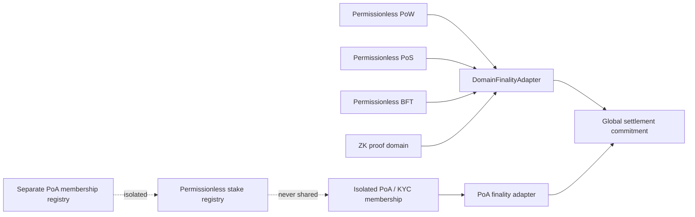

## 3. Transaction admission and V4 signing

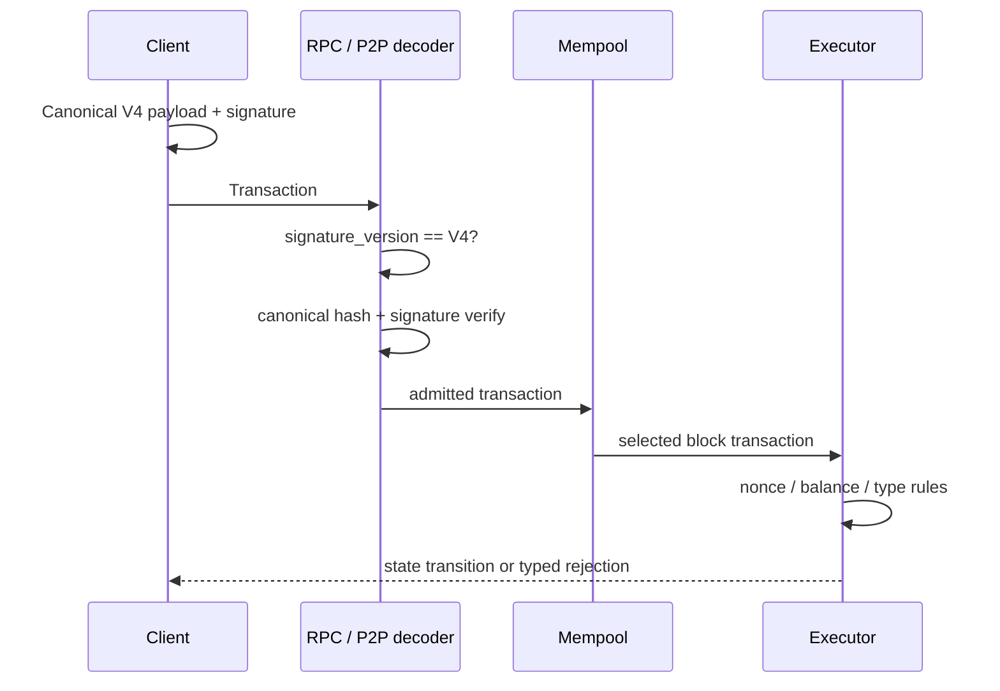

## 4. Cross-domain bridge lifecycle

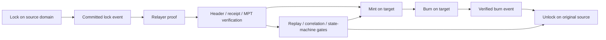

## 5. EVM receipt verification path

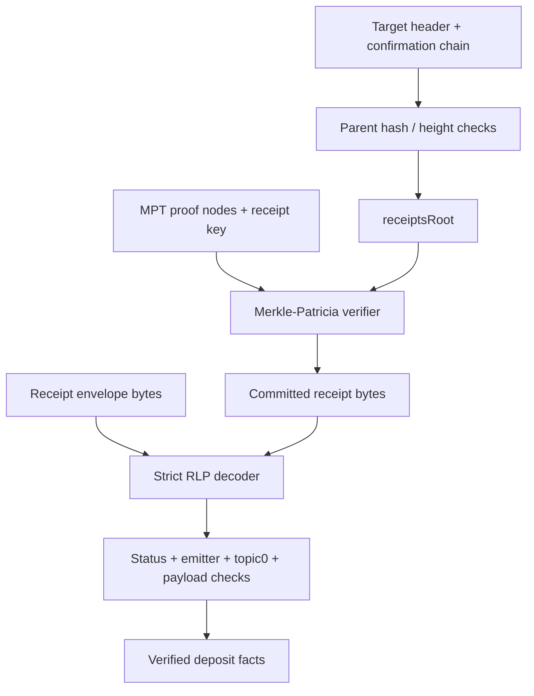

## 6. Snapshot trust and schema migration

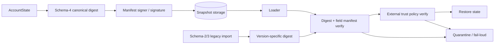

## 7. Critical durability boundary

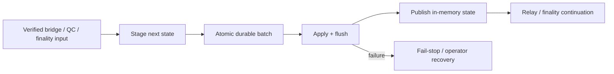

## 8. BudZero execution and proof boundary

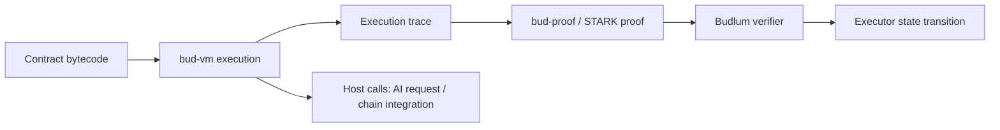

## 9. AI inference lifecycle

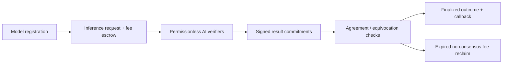

## 10. B.U.D. storage lifecycle

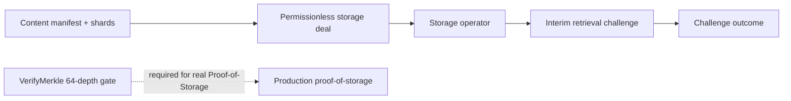

## 11. Mainnet launch gates

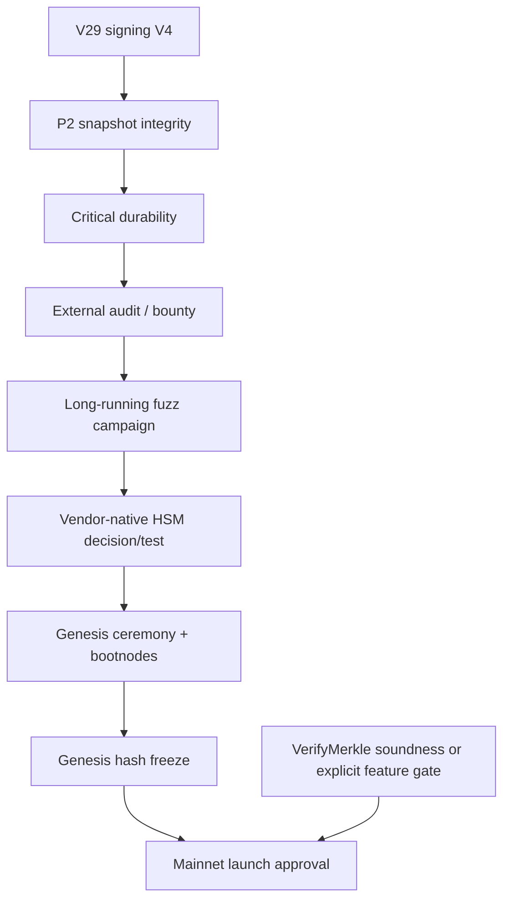

## 12. CI and security gates


## 13. Privacy layer — note lifecycle (D2)

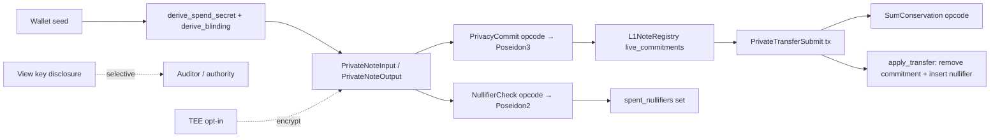

## 14. Wallet-core architecture

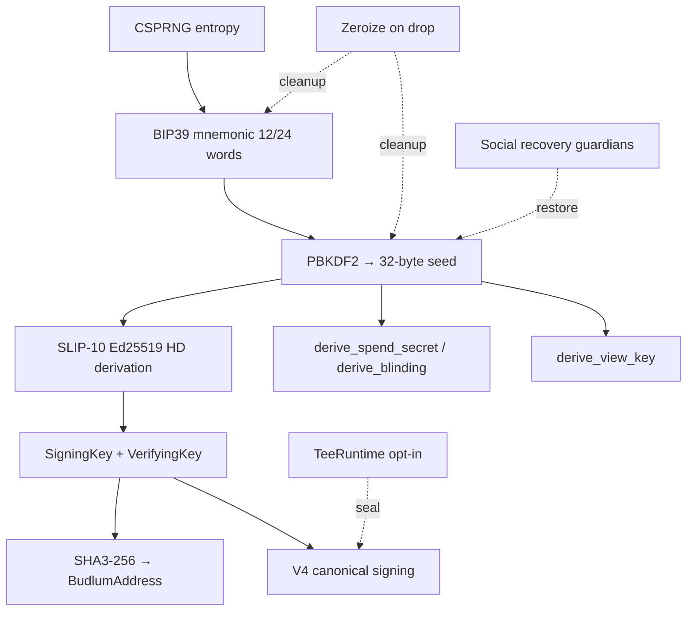

## 15. Governance lifecycle

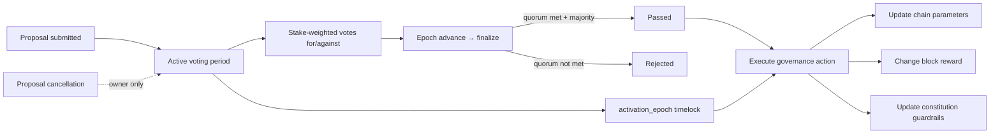

## 16. Tokenomics flow

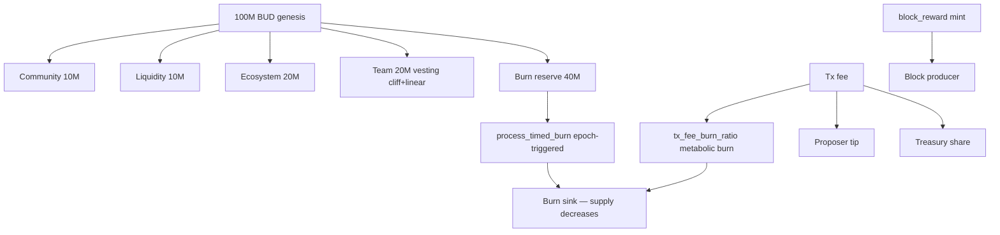

## 17. P2P network topology

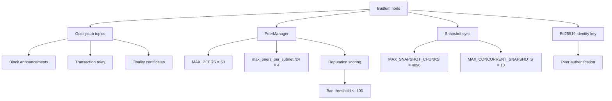

## 18. Permissionless registry architecture

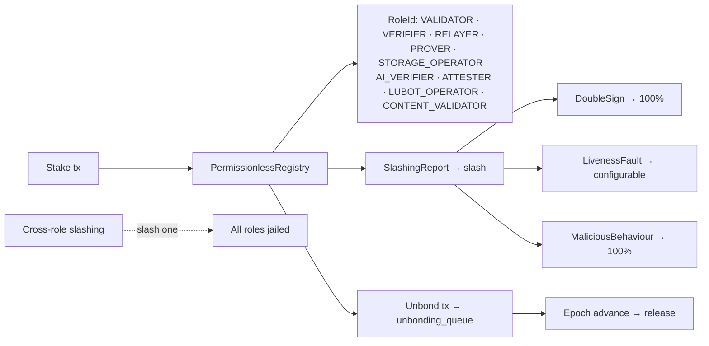

## 19. PoA domain lifecycle

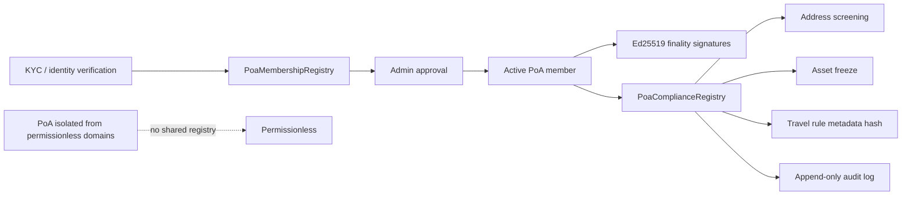

## 20. Validator lifecycle

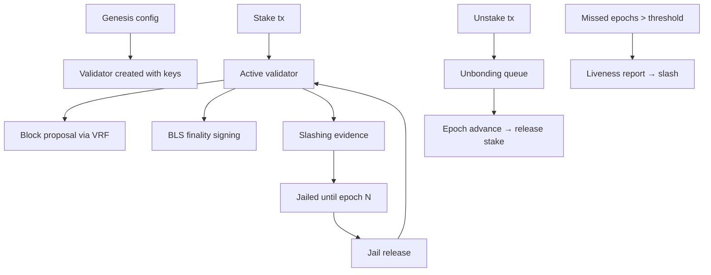

## 21. Pollen data rights lifecycle

```mermaid
flowchart LR
  Asset[DataAsset registered] --> Grant[AccessGrant issued]
  Grant --> Grantee[Grantee address + scope + expiry]
  Asset --> Sale[SaleAuthorization]
  Sale --> Buyer[Buyer purchases access]
  Buyer --> Purchase[PollenPurchaseReceipt]
  Grant --> AI[AI inference request]
  AI --> Gate[Pollen data gate: valid grant required]
  Gate -->|grant valid| Allow[Allow data read]
  Gate -->|no grant| Deny[Deny — strict default-deny]
  Encrypt[EncryptionPolicy DAO-managed] -. parameters .-> Asset
  Revoke[Revoke grant/asset] -. owner only .-> Grant
```

## 22. Relayer policy layer

```mermaid
flowchart LR
  User[User intent] --> Intent[UserIntent signed]
  Intent --> Pool[Intent pool]
  Pool --> Solver[Solver bids]
  Solver --> Best[Best bid selection]
  Best --> Settle[IntentSettlement]
  Settle --> Execute[Execute settlement]
  Policy[PolicyEnvelope] --> FeeCap[Fee cap enforcement]
  Policy --> Deadline[Deadline validation]
  Policy --> Domain[Domain allowlist]
  Policy --> Replay[Replay nonce check]
  Slashing[Relayer slashing] --> Griefing[Griefing → 100%]
  Slashing --> FrontRunning[Front-running → 100%]
  Slashing --> WrongRelay[Wrong-relay → 100%]
```

## 23. Fee market (EIP-1559)

```mermaid
flowchart LR
  Block[Block N-1 base_fee] --> Calc[next_base_fee calculation]
  Calc --> Adjustment[±12.5% adjustment based on gas usage]
  Adjustment --> BaseFee[Block N base_fee]
  Tx[Transaction] --> Bid[FeeBid: max_fee + max_priority_fee]
  Bid --> Effective[effective_fee = min(max_fee, base_fee + priority)]
  Effective --> Check[effective_fee ≥ base_fee?]
  Check -->|yes| Accept[Accepted]
  Check -->|no| Reject[Rejected — underpriced]
  Accept --> Burn[base_fee burned]
  Accept --> Tip[priority_fee → proposer]
```

## 24. AI execution proof pipeline

```mermaid
flowchart TD
  Model[FixedPointMlpSpec] --> Host[Host eval_fixed_point_mlp i32 MAC]
  Host --> Output[Output limbs]
  Model --> Guest[build_matmul_guest_program BudZKVM instructions]
  Guest --> ProgramHash[program_hash_from_words]
  Model --> Weights[weights_digest SHA3-256]
  Weights --> Bytecode[Guest bytecode: Load + Mul + Add + ReLU + Poseidon + Halt]
  Bytecode --> Prove[prove_bytecode → STARK proof]
  Prove --> Envelope[ProofEnvelope postcard]
  Envelope --> Attach[AiAttachExecutionProof tx]
  Attach --> Verify[Structural verify + program_hash bind]
  Verify --> STARK[STARK verify via DefaultAdapter]
  STARK --> Finalize[try_finalize_with_proofs]
```

## 25. DeEd content manifest architecture

```mermaid
flowchart LR
  Content[Raw content bytes] --> Hash[ContentId = SHA3-256 domain-tagged]
  Content --> Shards[Off-chain sharding]
  Shards --> ShardRef[ShardRef: shard_id + size]
  Hash --> Manifest[ContentManifest: shards + metadata + owner]
  Manifest --> ManifestId[ManifestId = deterministic hash]
  ManifestId --> Chain[On-chain registration]
  Chain --> Deal[Storage deal per shard]
  Deal --> Operator[Storage operator bonds]
  Deal --> Challenge[Retrieval challenge]
  Challenge --> Proof[VerifyMerkle 64-depth proof]
  Roles[Permissionless roles: STORAGE_OPERATOR · ATTESTER] -. no whitelist .-> Deal
```
