# Budlum Mimari Atlası

> **Durum:** Kod haritası ve hedef mimariyi birlikte gösterir. Diyagramlardaki
> `feature-gated`, `planlı` ve `mainnet blocker` etiketleri tamamlanmış üretim
> özelliği iddiası değildir.

## 1. Genel sistem mimarisi

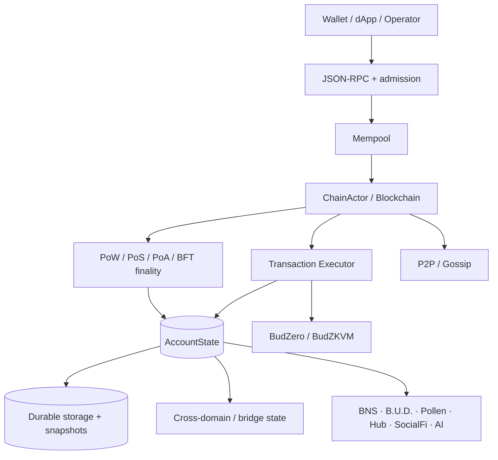

## 2. Consensus-domain izolasyonu

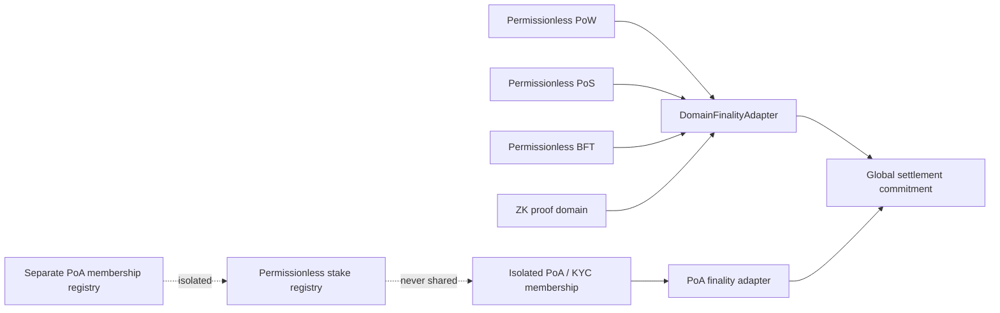

## 3. Transaction admission and V4 signing

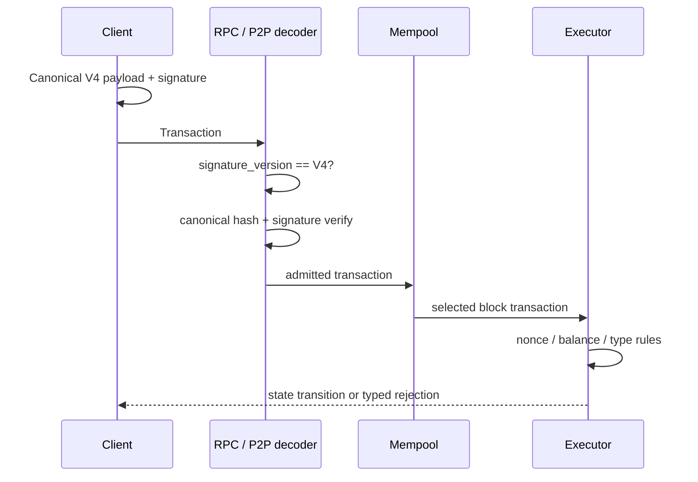

## 4. Cross-domain bridge lifecycle

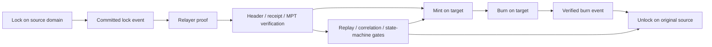

## 5. EVM receipt verification path

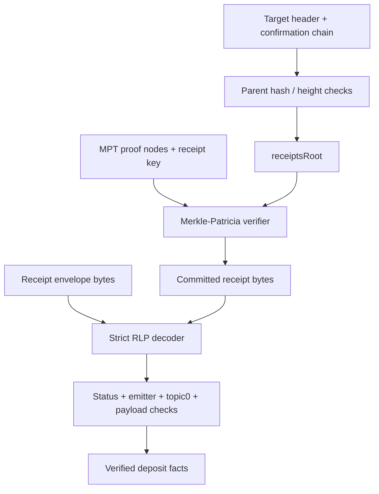

## 6. Snapshot trust and schema migration

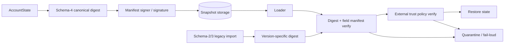

## 7. Critical durability boundary

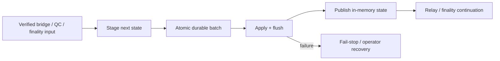

## 8. BudZero execution and proof boundary

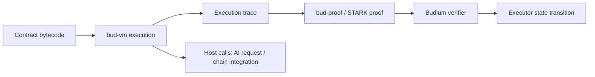

## 9. AI inference lifecycle

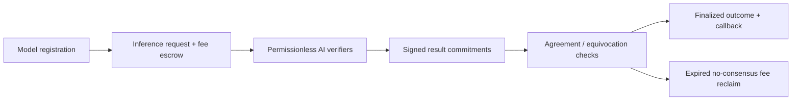

## 10. B.U.D. storage lifecycle

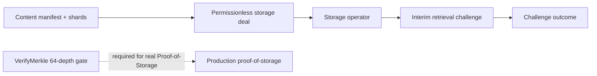

## 11. Mainnet launch gates

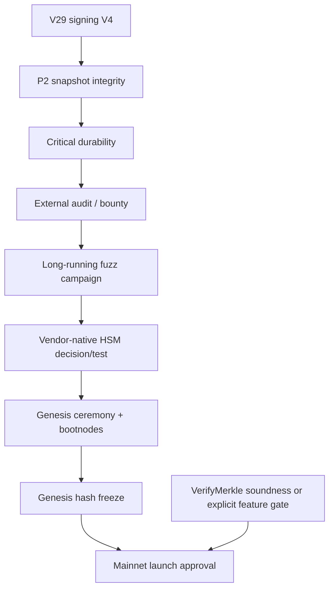

## 12. CI and security gates

