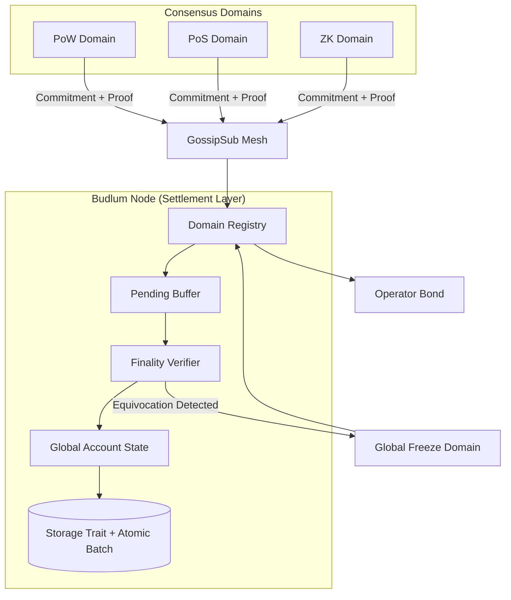

# Settlement Layer Test Matrix & Architecture

This document tracks the verification status of the Multi-Consensus Settlement Layer and provides an architectural overview.

## 1. Test Matrix

| Test Name | Property | Status |
|-----------|----------|--------|
| `test_cross_domain_double_spend_protection` | Shared-state safety | ✅ Passed |
| `test_parallel_cross_domain_stress_determinism` | Stress determinism | ✅ Passed |
| `test_async_gossip_random_delay_duplicate_drop` | Gossip convergence | ✅ Passed |
| `test_frozen_domain_persistence` | Byzantine state persistence | ✅ Passed |
| `test_adversarial_finality_proofs` | Finality proof validation | ✅ Passed |
| `test_restart_pending_buffer_persistence` | Crash recovery | ✅ Passed |
| `test_distributed_gossip_convergence` | Real-node convergence | ✅ Passed |
| `verified_pow_commitment_requires_finalized_depth_and_matching_proof_hash` | Raw-proof mismatch and PoW finality rejection | ✅ Passed |
| `full_bridge_lifecycle_lock_mint_burn_unlock_with_proof_verification` | Verified bridge lock/mint/burn/unlock lifecycle | ✅ Passed |
| `bridge_unlock_requires_verified_burn_event_from_target_domain` | Raw unlock rejection and target-domain burn proof requirement | ✅ Passed |

## 2. Architecture Diagram

## 3. Current Risks & Limitations

### Risks
- **Early-Stage Adapters:** Finality proof adapters (PoS/BFT) are currently using high-level signature threshold logic rather than full cryptographic BLS/Ed25519 verification.
- **Adapter Boundaries:** PoW now requires a non-zero work hint, and PoS binds certificate, snapshot, commitment, and domain validator-set hashes. PoA/BFT remain high-level quorum adapters until deeper cryptographic integration work is completed.
- **Networking Scale:** While tested with 5 nodes in a controlled harness, the behavior under 100+ nodes with high latency is not yet benchmarked.
- **Economic Safety:** Validator slashing and rewards are implemented for devnet-grade PoS flows, and domain registration now requires operator identity and bond. Mainnet-grade governance, bond sizing, and audit review are still required.

### Limitations
- **Controlled Public Devnet Ready:** The current code can support a public devnet with clear experimental disclaimers.
- **Not Mainnet-Ready:** The codebase still requires professional security audits, operational hardening, fuzzing, and full API/error cleanup before mainnet.
- **Formal Verification:** No TLA+ or formal proofs for the consensus convergence.
- **Public Testnet Scope:** Public devnet is appropriate; audited production/mainnet deployment is not.
- **Structured Errors:** `BudlumError` exists and critical execution paths use it, but legacy `Result<T, String>` compatibility remains in several APIs.

## 4. Budlum Core v0.1 — Controlled Public Devnet Candidate
The current state of the repository represents a **controlled public devnet candidate**, not an audited mainnet implementation.

**Key Achievements:**
- [x] Deterministic global state for heterogeneous domains.
- [x] Byzantine equivocation immunity (Model B).
- [x] Atomic settlement persistence for commitment + domain height/hash updates.
- [x] Verified-only domain commitment submission on public RPC/production chain paths.
- [x] Production parent-domain-block linkage check.
- [x] Strict nonce invariant rejection before durable insertion for immediately applicable commitments.
- [x] Verified bridge return path through committed `BridgeBurned` event proofs.
- [x] Distributed node convergence verified.
- [x] Slashing evidence gossip and block inclusion path.
- [x] PoS slashing/reward execution for devnet-grade validator economics.
