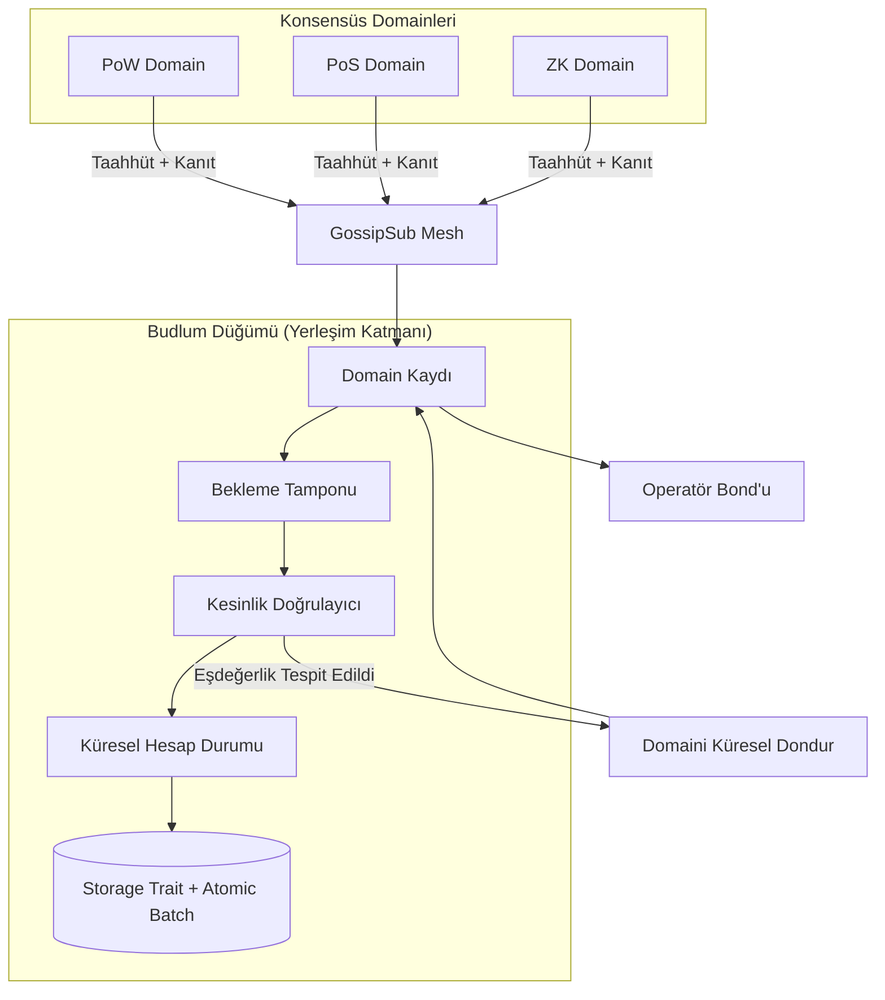

# Yerleşim Katmanı Test Matrisi ve Mimari

Bu döküman, Çoklu Konsensüs Yerleşim Katmanı'nın doğrulama durumunu takip eder ve mimari bir genel bakış sunar.

## 1. Test Matrisi

| Test Adı | Özellik | Durum |
|-----------|----------|--------|
| `test_cross_domain_double_spend_protection` | Paylaşımlı durum güvenliği | ✅ Geçti |
| `test_parallel_cross_domain_stress_determinism` | Stres determinizmi | ✅ Geçti |
| `test_async_gossip_random_delay_duplicate_drop` | Gossip yakınsaması | ✅ Geçti |
| `test_frozen_domain_persistence` | Bizans durum kalıcılığı | ✅ Geçti |
| `test_adversarial_finality_proofs` | Kesinlik kanıtı doğrulaması | ✅ Geçti |
| `test_restart_pending_buffer_persistence` | Çökme sonrası kurtarma | ✅ Geçti |
| `test_distributed_gossip_convergence` | Gerçek düğüm yakınsaması | ✅ Geçti |
| `verified_pow_commitment_requires_finalized_depth_and_matching_proof_hash` | Proof hash uyuşmazlığı ve PoW finality reddi | ✅ Geçti |
| `full_bridge_lifecycle_lock_mint_burn_unlock_with_proof_verification` | Doğrulanmış bridge lock/mint/burn/unlock lifecycle | ✅ Geçti |
| `bridge_unlock_requires_verified_burn_event_from_target_domain` | Raw unlock reddi ve target-domain burn proof zorunluluğu | ✅ Geçti |
| `test_prevote_precommit_full_lifecycle` | Tek validator prevote quorum → precommit → cert akışı | ✅ Geçti |
| `test_prevote_rejects_wrong_checkpoint_hash` | Yanlış hash'li prevote reddi | ✅ Geçti |
| `test_start_prevote_phase_creates_aggregator` | `start_prevote_phase()` `FinalityAggregator` oluşturur | ✅ Geçti |
| `test_handle_prevote_rejects_when_no_aggregator` | Aggregator yokken prevote reddi | ✅ Geçti |
| `test_handle_precommit_rejects_when_no_aggregator` | Aggregator yokken precommit reddi | ✅ Geçti |
| `test_actor_produce_block_starts_prevote_phase_on_checkpoint` | `ChainActor` checkpoint'te prevote fazını otomatik başlatır | ✅ Geçti |
| `test_actor_prevote_accepted_after_produce_checkpoint` | Checkpoint blok sonrası prevote kabul edilir | ✅ Geçti |
| `test_sign_with_signer` | `ConsensusSigner` trait üzerinden `sign_with_signer()` | ✅ Geçti |

## 2. Mimari Diyagram

Bu yerleşim/finality görünümü, kanonik [Budlum Mimari Atlası](../ARCHITECTURE.md)
içindeki genel sistem, trust-boundary, V4 imzalama, bridge, EVM receipt,
snapshot, durability, BudZero, AI, B.U.D., CI ve mainnet launch diyagramlarıyla
birlikte okunmalıdır.

## 3. Mevcut Riskler ve Sınırlamalar

### Riskler
- **Adapter Sınırları:** PoW artık sıfır olmayan work hint ister; PoS certificate, snapshot, commitment ve domain validator-set hash'lerini birbirine bağlar. PoA/BFT daha derin kriptografik entegrasyon tamamlanana kadar üst düzey quorum adapterlarıdır.
- **Ağ Ölçeği:** Kontrollü bir harness içinde 5 düğümle test edilmiş olsa da, yüksek gecikmeli 100+ düğüm altındaki davranış henüz benchmark edilmemiştir.
- **Ekonomik Güvenlik:** Validator slashing ve ödüller devnet seviyesindeki PoS akışları için uygulanmıştır; domain registration artık operatör kimliği ve bond gerektirir. Mainnet seviyesinde yönetişim, bond boyutlandırması ve audit incelemesi hâlâ gereklidir.

### Sınırlamalar
- **Kontrollü Public Devnet'e Hazır:** Mevcut kod açık deneysel uyarılarla public devnet çalıştırabilir.
- **Mainnet'e Hazır Değil:** Kod tabanı mainnet öncesi profesyonel güvenlik denetimleri, operasyonel sertleştirme, fuzzing ve API/error cleanup gerektirir.
- **Resmi Doğrulama:** Konsensüs yakınsaması için TLA+ veya resmi kanıtlar bulunmamaktadır.
- **Public Testnet Kapsamı:** Public devnet uygundur; audited production/mainnet deployment uygun değildir.
- **Structured Errors:** `BudlumError` vardır ve kritik execution path'leri bunu kullanır; fakat birkaç API'de `Result<T, String>` uyumluluğu korunmaktadır.

## 4. Budlum Core v0.1 — Kontrollü Public Devnet Adayı
Deponun mevcut durumu **kontrollü public devnet adayıdır**; audited mainnet implementasyonu değildir.

**Temel Başarılar:**
- [x] Heterojen domainler için deterministik küresel durum.
- [x] Bizans eşdeğerlik bağışıklığı (Model B).
- [x] Taahhüt + domain yükseklik/hash güncellemeleri için atomik settlement kalıcılığı.
- [x] Public RPC/production chain path'lerinde verified-only domain commitment gönderimi.
- [x] Production parent-domain-block linkage kontrolü.
- [x] Hemen uygulanabilir commitment'larda kalıcı insert öncesi katı nonce invariant reddi.
- [x] Commit edilmiş `BridgeBurned` event proof'ları üzerinden verified bridge dönüş yolu.
- [x] Dağıtık düğüm yakınsaması doğrulandı.
- [x] Slashing evidence gossip ve blok dahil etme akışı.
- [x] Devnet seviyesinde PoS slashing/reward execution.
- [x] PKCS#11 HSM imza adaptörü (`ConsensusSigner` trait + `Pkcs11Signer` + `KeyPairSigner`).
- [x] Finality aggregator kablolaması: Prevote/Precommit gossip → ChainActor → Blockchain aggregator → certificate production.
